<div align="center">

# Faith Laundry Shop Management System

**A full-stack web application that replaces manual logbooks with digital order tracking, automated pricing, and real-time sales reporting.**

Built with **Next.js** · **Spring Boot 3.5** · **PostgreSQL** · **Docker**

---

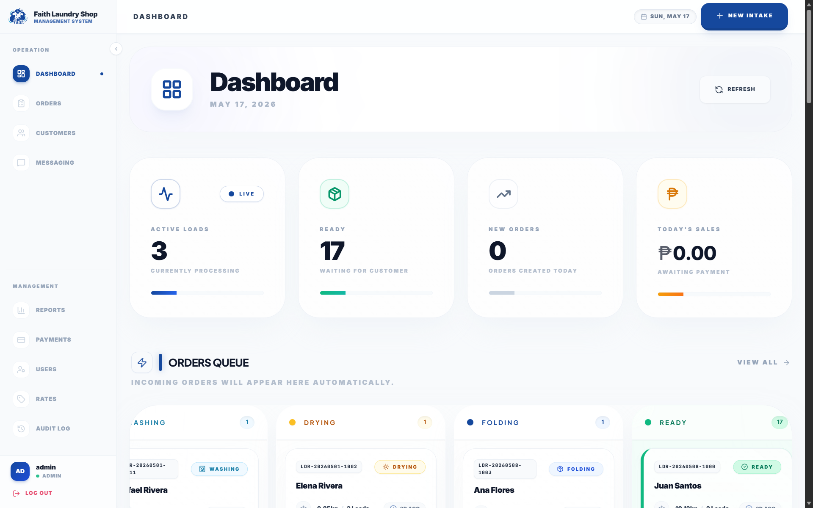

</div>

## Table of Contents

- [Overview](#overview)
- [Screenshots](#screenshots)
- [Features](#features)
- [Tech Stack](#tech-stack)
- [Getting Started](#getting-started)
- [Project Structure](#project-structure)
- [Architecture](#architecture)
- [API Reference](#api-reference)
- [Configuration](#configuration)
- [Contributing](#contributing)
- [Documentation](#documentation)
- [Team](#team)
- [License](#license)

## Overview

**Faith Laundry Shop** is a small-scale laundry service in Ilaya, Tabuc Suba, Jaro, Iloilo City, operating since 2022. The business relies on handwritten logbooks, physical tags, and paper receipts — leading to order mix-ups, slow record-keeping, and zero reporting capability.

This system digitizes the entire workflow: from order intake with automatic pricing computation, through a 6-stage status pipeline, to payment collection and automated sales reports.

> **Academic Context:** Developed by **HIMÓTECH** as a Systems Analysis and Design course deliverable at West Visayas State University.

## Screenshots

<div align="center">

| | |
|:---:|:---:|
|  | 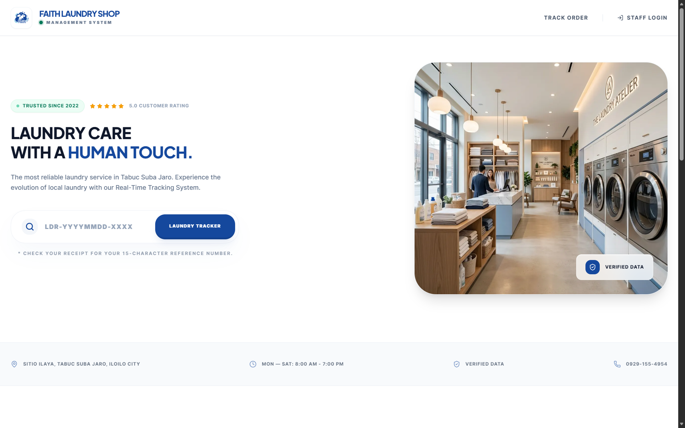 |
| **Login** — Secure JWT authentication | **Landing** — Public-facing homepage |
|  | 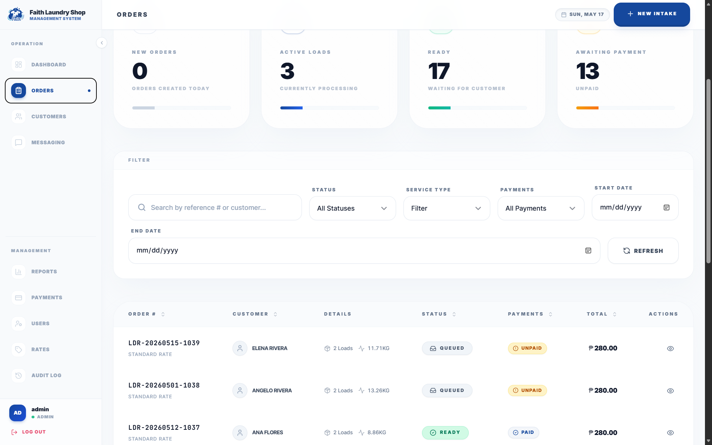 |
| **Dashboard** — KPI cards & order pipeline | **Orders** — Filterable order list |
| 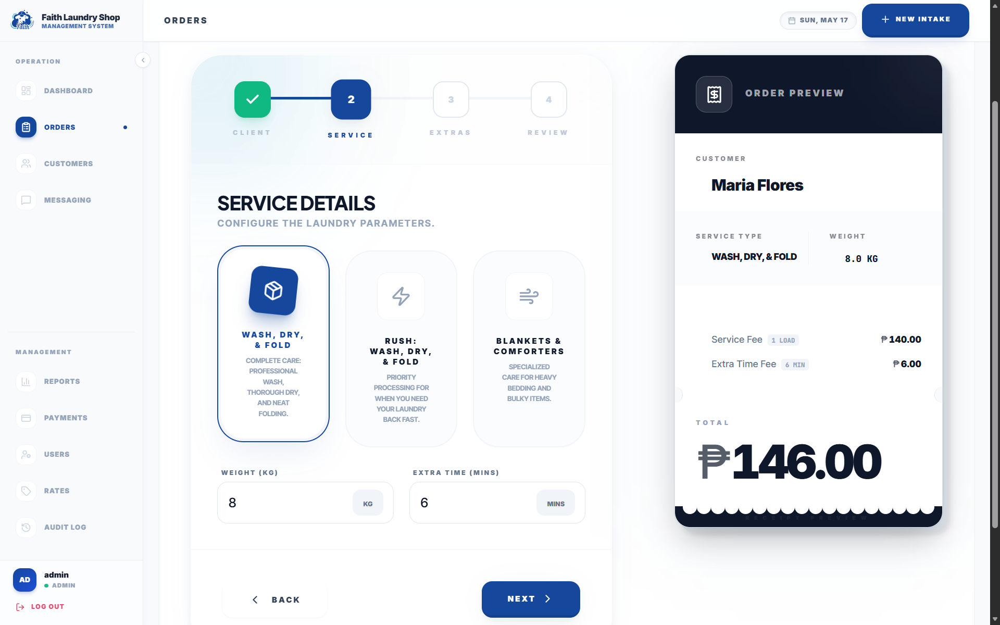 | 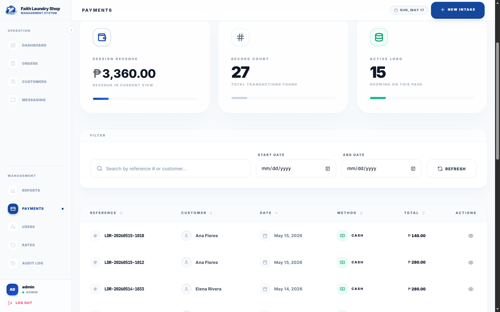 |
| **Order Intake** — Wizard with auto-pricing | **Payments** — Payment recording & history |
| 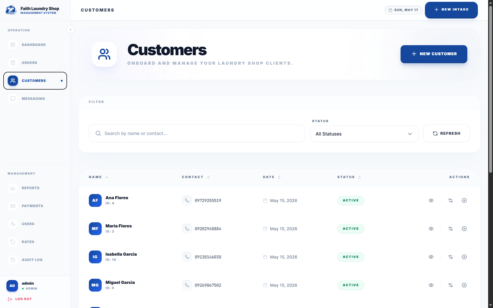 | 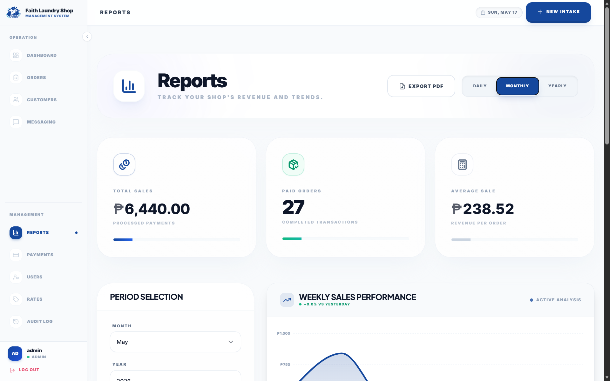 |
| **Customers** — Customer registry | **Reports** — Daily/monthly/yearly analytics |
| 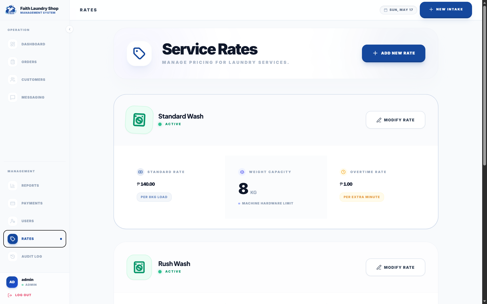 | 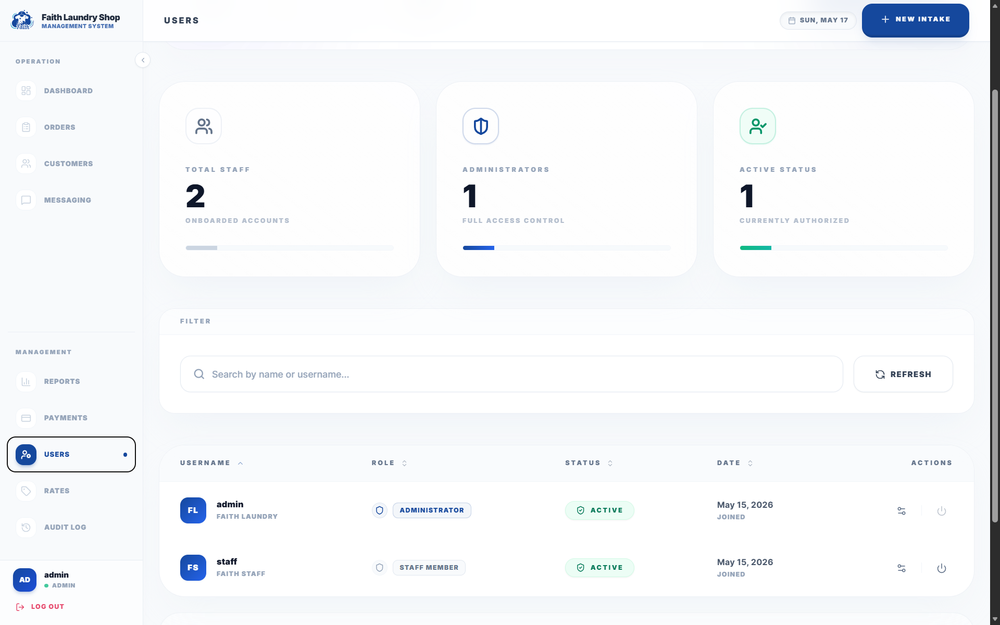 |
| **Service Rates** — Configurable pricing | **Users** — Role-based user management |
| 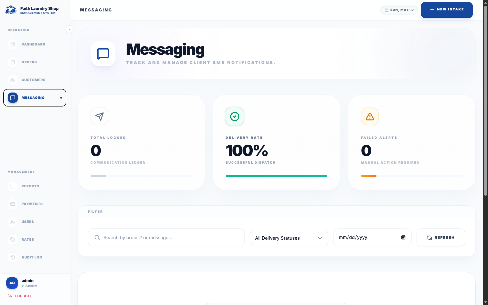 | 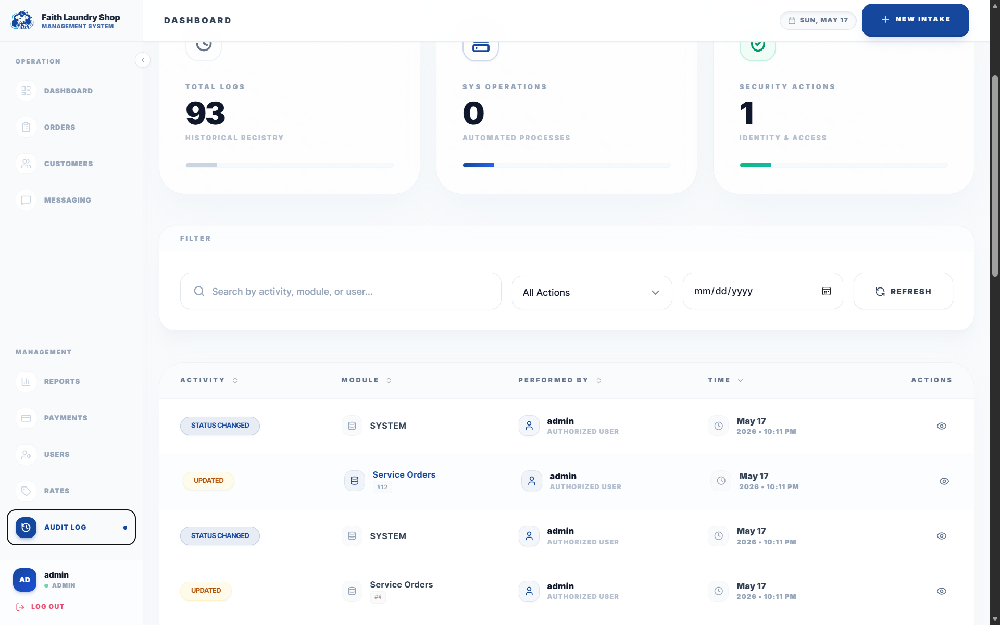 |
| **Messaging** — Client alert queue | **Audit Logs** — Forensic activity trail |
| 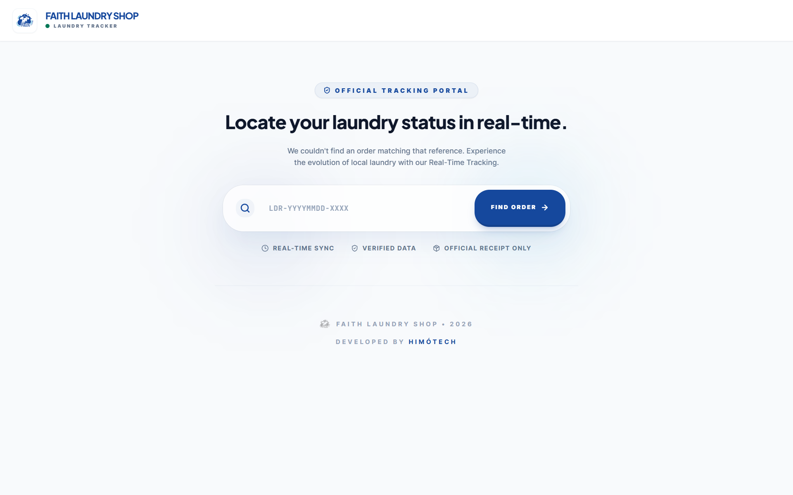 | |
| **Public Tracking** — No-login order status | |

</div>

## Features

### Order Management
- Record laundry orders with customer details, weight, and service type
- **Automatic pricing** — computes loads from weight (`ceil(weight / 8kg)`) and applies per-load rates
- Unique reference numbers (`LDR-YYYYMMDD-XXXX`) for every order
- Add-on charges (e.g., fabric conditioner) and extra-time billing

### Order Pipeline
- 6-stage status tracking: **Received → Washing → Drying → Folding → Ready for Pickup → Released**
- Drag-and-drop Kanban-style board on the dashboard
- Business rule enforcement — orders cannot be released until paid

### Payment & Reporting
- One-to-one payment recording linked to orders (Cash, GCash, Bank Transfer)
- **Automated sales reports** — daily, monthly, and yearly breakdowns
- Admin-only revenue analytics with visual charts

### Security & Audit
- JWT-based authentication with role-based access (Admin / Staff)
- Database-level forensic audit triggers on all core tables
- Complete audit trail — who changed what, when, with before/after snapshots

### Public Order Tracking
- Customers can check order status using their reference number — **no login required**
- Minimal data exposure (status and dates only, no internal IDs)

## Tech Stack

| Layer | Technology | Version |
|:---|:---|:---|
| **Frontend** | Next.js (React, TypeScript, Tailwind CSS) | 15.5.15 |
| **Backend** | Spring Boot (Java) | 3.5 / Java 21 LTS |
| **Database** | PostgreSQL | 16 |
| **Migrations** | Flyway | Embedded |
| **Build** | Maven (wrapper included) | 3.9+ |
| **Containerization** | Docker & Docker Compose | Latest |
| **Testing** | JUnit 5, Testcontainers | Latest |
| **UI Framework** | Tailwind CSS, Framer Motion, Lucide Icons | Latest |

## Getting Started

### Prerequisites

| Tool | Version | Check |
|:---|:---|:---|
| [Docker Desktop](https://www.docker.com/products/docker-desktop) | Latest | `docker --version` |
| [Java JDK](https://adoptium.net/) | 21 LTS | `java -version` |
| [Node.js](https://nodejs.org/) | 18+ LTS | `node --version` |
| [Git](https://git-scm.com/) | Latest | `git --version` |

> **Note:** Maven is included via the project's wrapper (`mvnw` / `mvnw.cmd`) — no separate install needed.

### 🚀 Option 1: Hybrid Dev Setup (Recommended for WSL/Linux)

This is the fastest, most optimized setup. It isolates PostgreSQL in Docker but runs the frontend and backend natively to utilize local hardware and fast filesystem event watching (Turbopack).

**Prerequisite:** Ensure Node.js v20+ and Java 21 are installed natively on your host machine.

```bash
# 1. Clone & Configure
git clone <repository-url>
cd laundry-shop-management-system
cp .env.example .env

# 2. Start Database in Docker
docker compose up -d db

# 3. Start Backend natively (Terminal 1)
# Note: Linux users must export .env variables before running Maven
export $(grep -v '^#' .env | xargs) && cd backend && ./mvnw spring-boot:run

# 4. Start Frontend natively (Terminal 2)
cd frontend
cp .env.local.example .env.local
# Make sure .env.local has: NEXT_PUBLIC_API_URL=http://localhost:8080/api
npm install
npm run dev
```

### 📦 Option 2: Full Docker Setup (Containerized)

This setup is ideal if you do not have Java or Node.js installed natively, or if you want to verify production-like container builds. Everything runs inside Docker.

```bash
# 1. Clone & Configure
git clone <repository-url>
cd laundry-shop-management-system
cp .env.example .env

# 2. Start Full Stack
docker compose --profile full up -d
```
> **Note on Permissions:** If switching from Full Docker back to Hybrid mode, you may encounter `Permission Denied` errors because Docker creates root-owned files in `node_modules/` and `target/`. Clean them up using a dockerized remove command:
> `docker run --rm -v $(pwd)/frontend:/app -w /app postgres:16-alpine rm -rf node_modules .next`

### 💻 Option 3: Offline-First Standalone Setup (Windows Desktop)

This setup provides a single double-clickable `.exe` Windows installer wizard (built via Inno Setup) with the statically exported Next.js frontend, Spring Boot backend, custom app icon, and automated WinSW background service configuration. This is intended for production deployment on Windows 10/11 machines without any developer tools installed.

1. **Build the Standalone Installer**:
   Open PowerShell:
   ```powershell
   cd scripts
   .\build-installer.ps1
   ```
2. **Install**:
   Double-click the generated `LaundryShopMS-Setup-1.0.0.exe` installer wizard in `backend\target\`. The installer automatically provisions PostgreSQL silently, sets environment variables, installs the `LaundryShopMS` background Windows service, creates Desktop & Start Menu shortcuts, registers in Add/Remove Programs, and opens `http://localhost:8080` in your browser.

### Verify Everything is Running

| Service | Mode | URL | Expected |
|:---|:---|:---|:---|
| **Frontend UI** | Both | http://localhost:3000 | Application loads |
| **Backend API** | Hybrid | http://localhost:8080/api/v1/health | HTTP 200 OK |
| **Backend API** | Full Docker | http://localhost:8081/api/v1/health | HTTP 200 OK |
| **Database** | Both | `localhost:5433` | Connection successful |

### Utility Scripts

| Command | Description |
|:---|:---|
| `docker compose up db backend` | Start database + backend (recommended) |
| `docker compose --profile full up -d` | Start full stack including frontend container |
| `docker compose down` | Stop all services |
| `./scripts/fresh.ps1` | Reset DB, re-migrate, and re-seed (keeps caches) |
| `./scripts/share.ps1` | Share local environment via ngrok |

## Project Structure

```
laundry-shop-management-system/
├── backend/                          # Spring Boot REST API (Java 21)
│   ├── src/main/java/com/himotech/laundryms/
│   │   ├── auth/                     # JWT authentication & login
│   │   ├── orders/                   # Order CRUD & status pipeline
│   │   ├── customers/                # Customer registry
│   │   ├── payments/                 # Payment processing
│   │   ├── rates/                    # Service rate configuration
│   │   ├── reports/                  # Sales report generation
│   │   ├── auditlog/                 # Forensic audit trail
│   │   ├── clientalert/              # Customer notifications (SMS)
│   │   ├── users/                    # User management (RBAC)
│   │   ├── security/                 # JWT filter & Spring Security
│   │   └── config/                   # App configuration
│   └── src/main/resources/
│       ├── db/migration/             # Flyway SQL migrations
│       └── application.yml           # Spring Boot config
├── frontend/                         # Next.js client (TypeScript)
│   └── src/
│       ├── app/                      # App Router pages
│       │   ├── (auth)/               # Login page
│       │   ├── (dashboard)/          # Protected dashboard routes
│       │   └── (public)/             # Landing & public tracking
│       ├── components/               # Shared UI components
│       │   └── features/             # Feature-specific modules
│       ├── contexts/                 # React context providers
│       └── hooks/                    # Custom React hooks
├── docs/                             # Project documentation (source of truth)
├── academic-docs-deliverables/       # SDLC academic manuscript
├── scripts/                          # Utility scripts (backup, reset, share)
├── docker-compose.yml                # Dev stack
├── docker-compose.prod.yml           # Production stack
├── .env.example                      # Environment template
└── README.md                         # ← You are here
```

## Architecture

```
┌──────────────────────┐
│     Next.js 15.5.15  │  React + TypeScript + Tailwind CSS
│     (Frontend)       │  Glassmorphism UI with Framer Motion
│                      │  App Router with Route Groups
└──────────┬───────────┘
           │ HTTP / REST
           ▼
┌──────────────────────┐
│   Spring Boot 3.5    │  Java 21 LTS
│     (Backend)        │  JWT Auth + RBAC
│                      │  Business rules enforcement
└──────────┬───────────┘  Pricing computation engine
           │ JDBC
           ▼
┌──────────────────────┐
│   PostgreSQL 16      │  pgcrypto (UUID generation)
│    (Database)        │  Flyway schema migrations
│                      │  Database-level audit triggers
└──────────────────────┘
```

### Database Tables

| Table | Purpose |
|:---|:---|
| `users` | System users with UUID PKs and role-based access (Admin/Staff) |
| `customers` | Customer registry with contact validation |
| `service_rates` | Configurable pricing rules (base price, kg limit, extra-minute rate) |
| `orders` | Central transaction table with price snapshots and status tracking |
| `order_add_ons` | Flexible line-item charges per order |
| `payments` | One-to-one payment records (Cash, GCash, Bank Transfer) |
| `client_alerts` | Customer notification queue (SMS via Semaphore) |
| `audit_logs` | Forensic audit trail via database triggers (INSERT/UPDATE/DELETE) |

> **Design decisions:** Orders snapshot pricing at creation time for historical accuracy. Audit logging is handled at the database level via triggers (`fn_audit_log`) for tamper-resistant traceability.

## API Reference

When the backend is running, full interactive documentation is available at:
- **Swagger UI:** http://localhost:8080/swagger-ui.html
- **OpenAPI JSON:** http://localhost:8080/v3/api-docs

### Key Endpoints

| Method | Endpoint | Description | Auth |
|:---|:---|:---|:---|
| `POST` | `/api/v1/orders` | Create order (auto-computes pricing) | Staff/Admin |
| `PATCH` | `/api/v1/orders/{id}/status` | Advance order status | Staff/Admin |
| `GET` | `/api/v1/orders/reference/{ref}` | Public order tracking | None |
| `POST` | `/api/v1/payments` | Record payment | Staff/Admin |
| `GET` | `/api/v1/reports/sales/daily` | Daily sales report | Admin |
| `GET` | `/api/v1/reports/sales/monthly` | Monthly income report | Admin |
| `GET` | `/api/v1/reports/sales/yearly` | Yearly income report | Admin |
| `GET` | `/api/v1/health` | Health check | None |

For the complete API contract, see [`docs/05-tech-design/openapi.yaml`](docs/05-tech-design/openapi.yaml).

## Configuration

The project uses a **single unified `.env` file** at the project root. Copy from the template:

```bash
cp .env.example .env
```

### Key Variables

| Variable | Description | Default |
|:---|:---|:---|
| `DB_HOST` | PostgreSQL host | `localhost` |
| `DB_PORT` | PostgreSQL port | `5433` |
| `DB_NAME` | Database name | `laundry_db` |
| `DB_USER` | Database user | `laundry_user` |
| `DB_PASSWORD` | Database password | *(change this)* |
| `JWT_SECRET` | JWT signing secret (min 32 chars) | *(change this)* |
| `SPRING_PROFILES_ACTIVE` | Spring profile (`dev` / `prod`) | `dev` |
| `ALLOWED_ORIGIN` | CORS allowed origin | `http://localhost:3001` |

> ⚠️ **Security:** Never commit `.env` to Git. It is already in `.gitignore`.

### Production Deployment

```bash
# Configure .env for production (strong passwords, real JWT secret)
# Then start the production stack:
docker compose -f docker-compose.prod.yml up -d --build
```

See [`docs/06-implementation/deployment-guide.md`](docs/06-implementation/deployment-guide.md) for full production deployment instructions including Render, Vercel, and Neon setup.

## Contributing

### Branch Strategy

| Branch | Purpose |
|:---|:---|
| `main` | Production-ready. Protected — no direct commits. |
| `develop` | Active development. All PRs target this branch. |
| `feature/*` | New features (e.g., `feature/order-preview`) |
| `fix/*` | Bug fixes (e.g., `fix/payment-validation`) |

### Workflow

1. Sync: `git checkout develop && git pull --rebase origin develop`
2. Branch: `git checkout -b feature/your-feature`
3. Commit using [Conventional Commits](https://www.conventionalcommits.org/) (`feat:`, `fix:`, `docs:`, etc.)
4. Push and open a PR **into `develop`**
5. Request review — do not merge your own PR

### PR Checklist

- [ ] Fill out the [PR template](.github/pull_request_template.md)
- [ ] Link user stories (US-xx) or business rules (BR-xx) if applicable
- [ ] Tests pass: `./mvnw test` (backend) / `npm run lint && npm run build` (frontend)
- [ ] At least one reviewer approved

## Documentation

All project documentation lives in the [`docs/`](docs/) directory:

| Topic | Document |
|:---|:---|
| 📋 Documentation Index | [`docs/README.md`](docs/README.md) |
| 📝 Case Study | [`docs/00-context/case-study.md`](docs/00-context/case-study.md) |
| 🎯 Project Scope | [`docs/01-scope/project-scope.md`](docs/01-scope/project-scope.md) |
| 📖 User Stories | [`docs/02-requirements/user-stories.md`](docs/02-requirements/user-stories.md) |
| ⚙️ Business Rules | [`docs/02-requirements/business-rules.md`](docs/02-requirements/business-rules.md) |
| 🗄️ Database Design (ERD) | [`docs/04-data-design/erd.dbml`](docs/04-data-design/erd.dbml) |
| 🔌 API Contract | [`docs/05-tech-design/openapi.yaml`](docs/05-tech-design/openapi.yaml) |
| 🏗️ Architecture | [`docs/05-tech-design/architecture.md`](docs/05-tech-design/architecture.md) |
| 🚀 Deployment Guide | [`docs/06-implementation/deployment-guide.md`](docs/06-implementation/deployment-guide.md) |
| 📘 User Manual | [`docs/06-implementation/user-manual.md`](docs/06-implementation/user-manual.md) |
| 🔑 Dev Credentials | [`docs/development-credentials.md`](docs/development-credentials.md) |

## Team

**HIMÓTECH** — West Visayas State University, La Paz, Iloilo City

| Member | Role |
|:---|:---|
| Brillantes, Luisa Rose | Developer |
| Cadangin, Mark Alvin | Developer |
| Calisa, Eliza May | Developer |
| De la Cruz, Christian Paul | Developer |
| Serra, Alyanna Bianca | Developer |
| Tacleon, Ellen Mae | Developer |

## License

This project is developed for academic purposes as part of the Systems Analysis and Design course at West Visayas State University. All rights reserved.

---

<div align="center">

**Faith Laundry Shop Management System** · Built with ❤️ by HIMÓTECH · May 2026

</div>
