<div align="center">

# Faith Laundry Shop Management System

**A production-grade, full-stack business management system that digitizes a real-world laundry shop — replacing handwritten logbooks with automated order pipelines, real-time analytics, and a customer-facing tracking portal.**

[](https://nextjs.org/)
[](https://spring.io/projects/spring-boot)
[](https://openjdk.org/)
[](https://postgresql.org/)
[]()

---

🌐 **[Live Customer Portal](https://laundry-shop-management-system.vercel.app)**  ·  🔨 **[OpenAPI Spec](docs/05-tech-design/openapi.yaml)**

---

</div>

## Table of Contents

- [Overview](#overview)
- [Screenshots](#screenshots)
- [Features](#features)
- [Tech Stack](#tech-stack)
- [Architecture](#architecture)
- [Getting Started](#getting-started)
- [Project Structure](#project-structure)
- [API Reference](#api-reference)
- [Configuration](#configuration)
- [Testing](#testing)
- [Contributing](#contributing)
- [Documentation](#documentation)
- [Team](#team)
- [License](#license)

---

## Overview

**Faith Laundry Shop** is a real, operating small-scale laundry business in Iloilo City, Philippines. Before this system, the owner tracked every order in handwritten logbooks, wrote tags by hand, and had no way to generate sales reports or recover lost order data.

This project is a **production-deployed, end-to-end digitization** of that workflow. It covers the full SDLC — from stakeholder interviews and requirements elicitation to deployment via a custom Windows installer — and is built to the standards expected in a professional software engineering role.

**What makes it non-trivial:**
- A **custom pricing engine** that computes loads from weight, applies configurable service rates, and snapshots prices at order creation for historical accuracy
- **Database-level audit triggers** for tamper-resistant forensic traceability
- A **custom Windows installer** (Inno Setup) that silently provisions PostgreSQL, configures a WinSW background service, writes production `application.properties`, and stores the public portal URL for QR code generation — all without requiring any developer tooling on the target machine
- A **public customer tracking portal** (Vercel) where customers scan the QR code on their printed thermal receipt and see live order status — no login required
- **Real-time machine availability tracking** at intake — staff see which washers/dryers are currently in use before assigning loads
- **241 automated tests** (JUnit + Testcontainers + Vitest) running against a real containerized PostgreSQL instance

> **Developer:** Mark Alvin Cadangin

---

## Screenshots

<div align="center">

| | |
|:---:|:---:|
| 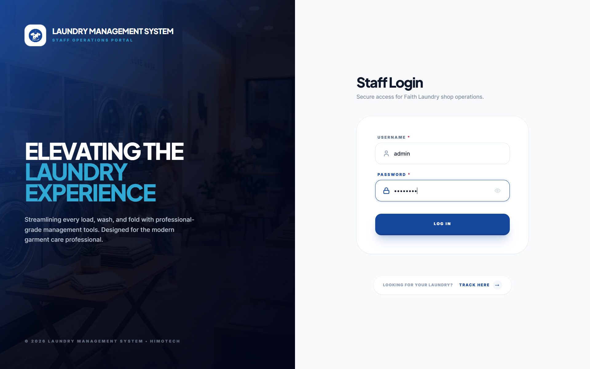 | 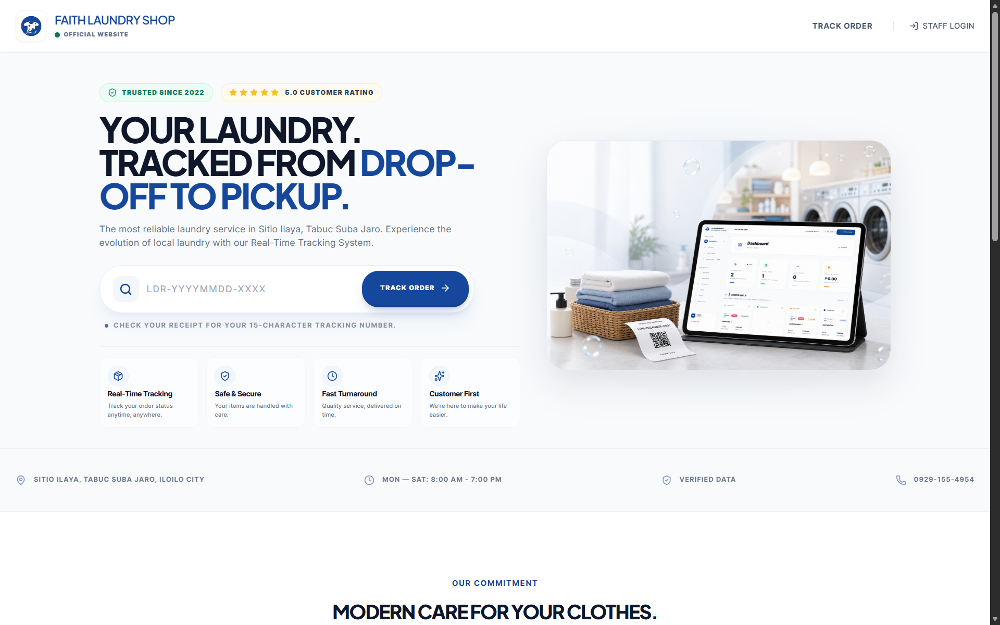 |
| **Login** — JWT auth with rate limiting | **Landing** — Public-facing homepage |
| 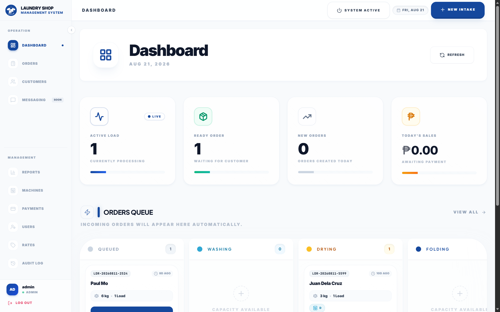 | 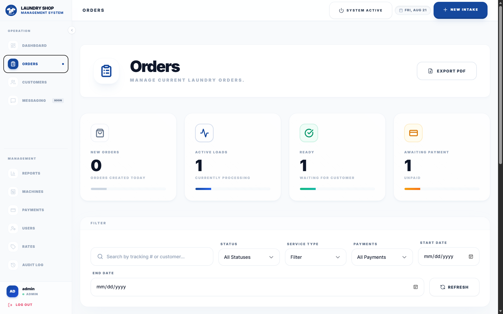 |
| **Dashboard** — KPI cards & Kanban order pipeline | **Orders** — Filterable, searchable order list |
| 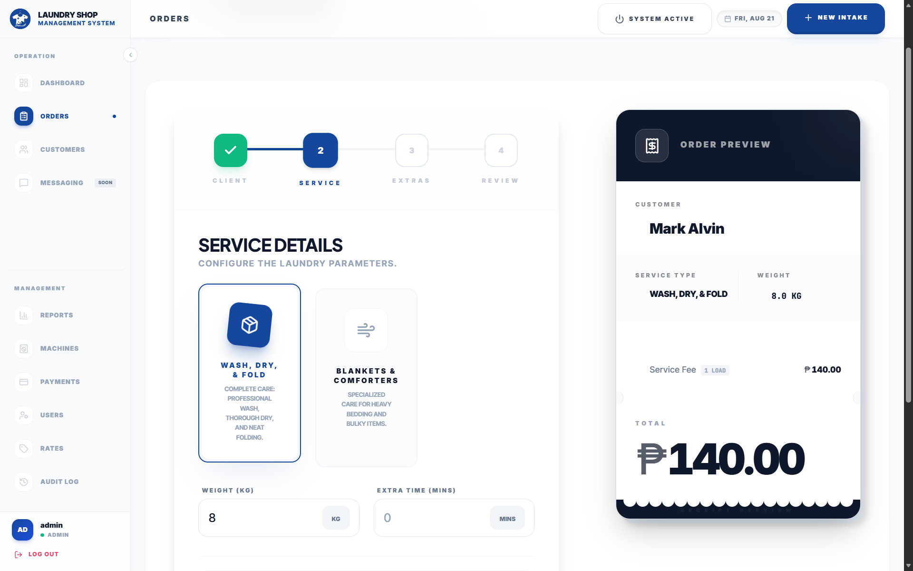 | 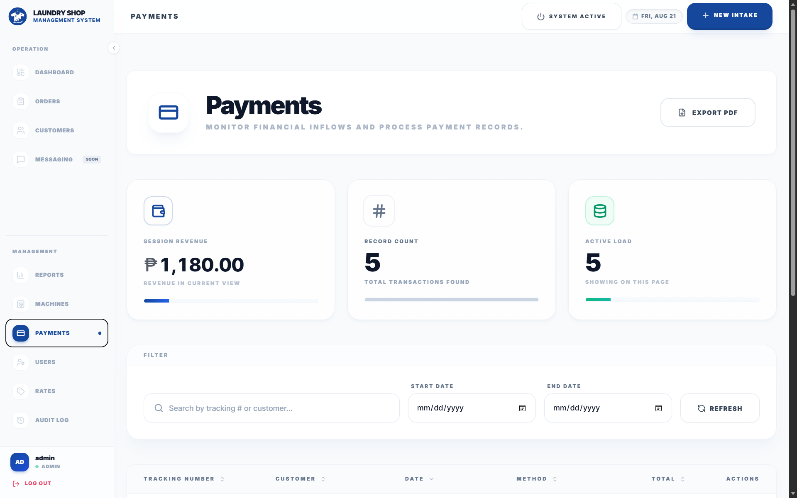 |
| **Order Intake** — Wizard with real-time pricing & machine availability | **Payments** — Payment recording & ledger |
| 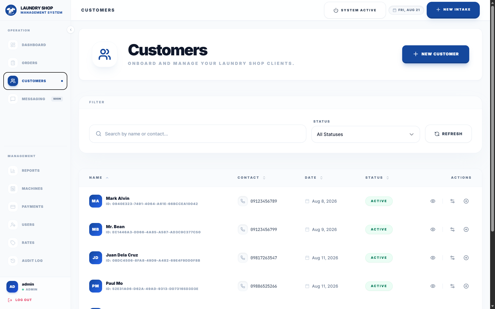 | 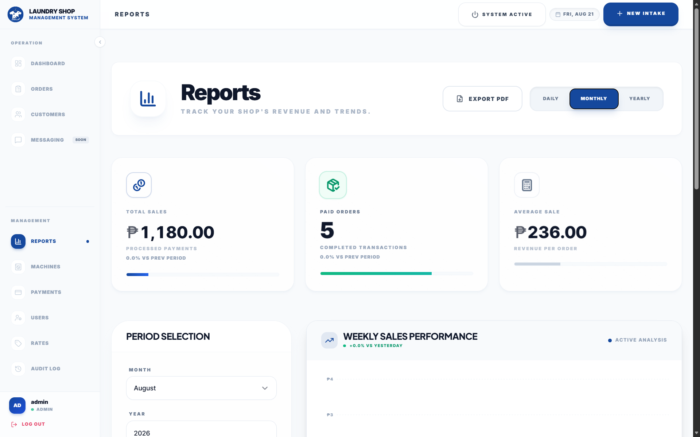 |
| **Customers** — Customer registry with order history | **Reports** — Daily/monthly/yearly revenue analytics |
| 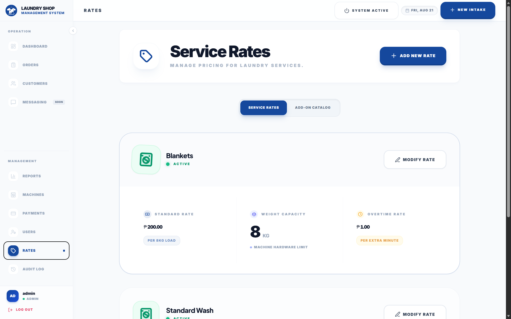 | 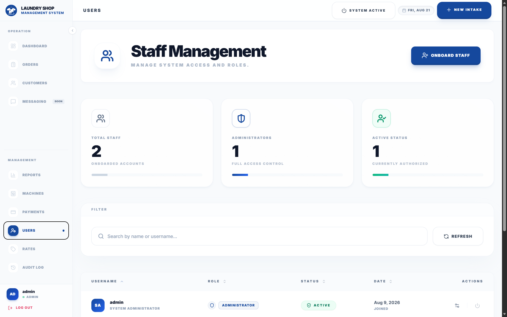 |
| **Service Rates** — Configurable pricing rules | **Users** — Role-based user management (Admin/Staff) |
| 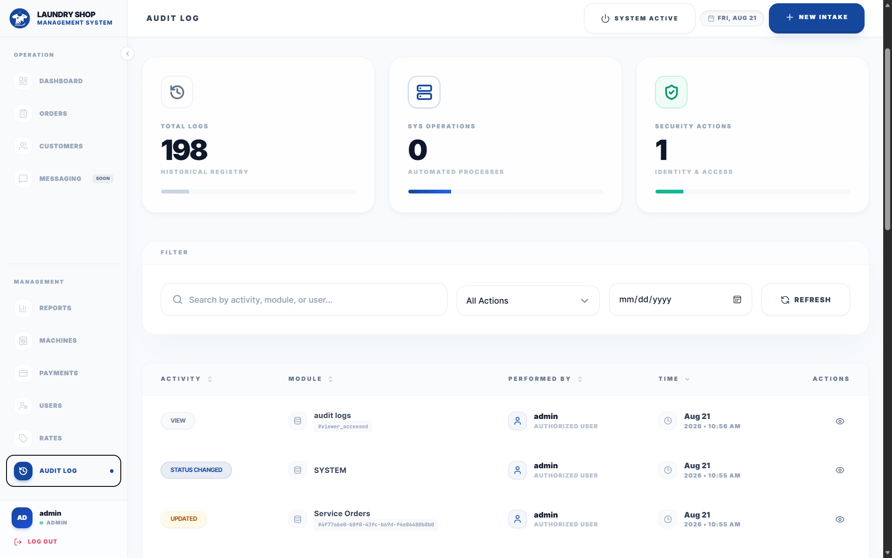 | 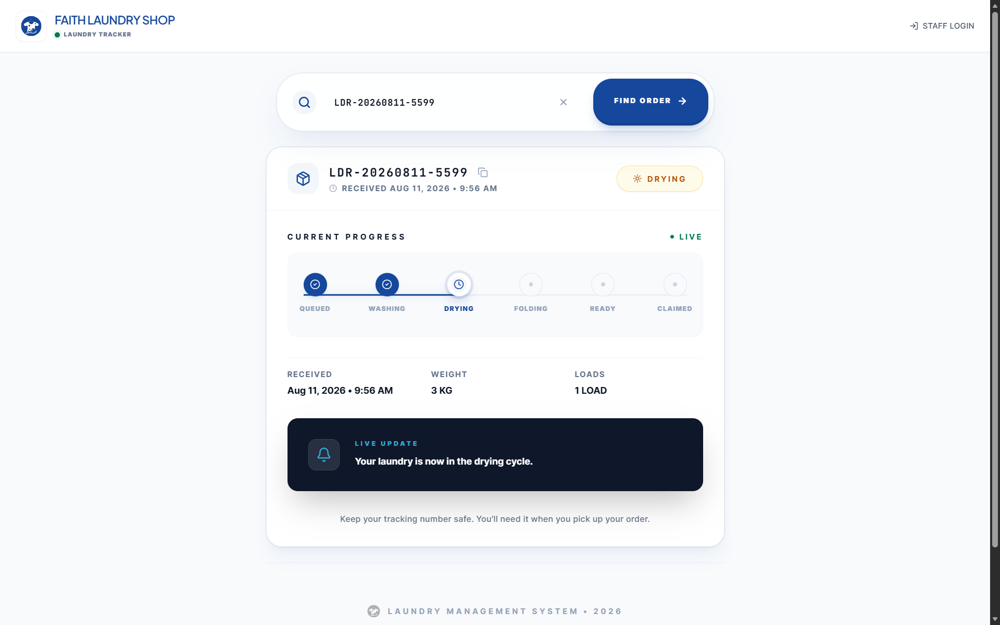 |
| **Audit Logs** — Forensic activity trail | **Public Tracking Portal** — QR scan → live status, no login |

</div>

> 📸 To add a screenshot, save a PNG to [`.github/assets/`](.github/assets/) with the filename matching the table above.


---

## Features

### 🧺 Order Management
- Multi-step intake wizard: customer lookup/creation, weight entry, service selection, machine assignment, add-on charges
- **Automatic pricing engine** — computes loads from weight (`⌈weight ÷ 8kg⌉`), applies per-load rates, adds extra-time billing
- Unique reference numbers (`LDR-YYYYMMDD-XXXX`) per order; prices snapshotted at creation for historical accuracy
- Thermal receipt generation with barcode + QR code linking to the live public tracking portal

### 🔄 Order Pipeline
- 6-stage status tracking: **Received → Washing → Drying → Folding → Ready for Pickup → Released**
- Business rule enforcement: orders cannot be released until fully paid
- Real-time Kanban board on the dashboard

### 🖥️ Machine Availability
- Staff see machine status (Available / In Use / Maintenance / Down) in real time at order intake
- Prevents assigning loads to machines that are already occupied
- Machine status managed by Admin through the Machines page

### 📱 Customer Tracking Portal
- Deployed to **[Vercel](https://laundry-shop-management-system.vercel.app)** — publicly accessible
- Customers scan the QR code on their receipt → tracking number auto-loaded → live status shown instantly
- Zero login required; exposes status and timeline only (no internal IDs or PII)

### 💳 Payment & Reporting
- One-to-one payment recording per order (Cash, GCash, Bank Transfer)
- Automated sales reports — daily, monthly, and yearly breakdowns with visual charts
- Admin-only revenue analytics

### 🔐 Security & Audit
- JWT authentication with HttpOnly cookie refresh token rotation
- Role-based access control (Admin / Staff) enforced at API and UI layers
- Login attempt throttling (lockout after N failures)
- **Database-level forensic audit triggers** on all core tables — tamper-resistant `INSERT/UPDATE/DELETE` logging with before/after JSON snapshots

### 💻 Offline-First Windows Installer
- Single `.exe` installer built with Inno Setup — no developer tools required on target machine
- Silently provisions PostgreSQL, installs WinSW background service, writes production Spring Boot config
- Captures the shop's public portal URL at install time and stores it for QR code generation
- Creates Desktop & Start Menu shortcuts; registers in Add/Remove Programs

---

## Tech Stack

| Layer | Technology | Version / Notes |
|:---|:---|:---|
| **Frontend** | Next.js (React, TypeScript, Tailwind CSS) | 15.5 · App Router |
| **Backend** | Spring Boot (Java) | 3.5 · Java 21 LTS |
| **Database** | PostgreSQL | 16 |
| **Migrations** | Flyway | Embedded in Spring Boot |
| **Build** | Maven (wrapper included) | 3.9+ — no install needed |
| **Containerization** | Docker & Docker Compose | Dev + prod profiles |
| **Frontend Testing** | Vitest + React Testing Library | 90 tests |
| **Backend Testing** | JUnit 5 + Testcontainers | 151 tests against real PostgreSQL |
| **Installer** | Inno Setup (compiled via PowerShell) | Offline Windows `.exe` |
| **Customer Portal** | Vercel | Auto-deploys from `main` |
| **SMS Notifications** | Semaphore API | Backend ready · UI coming soon |
| **UI** | Tailwind CSS, Framer Motion, Lucide Icons | — |

---

## Architecture

```
┌─────────────────────────────────────────┐
│          Next.js 15 (Frontend)          │
│  React · TypeScript · Tailwind CSS      │
│  App Router · Framer Motion animations  │
│                                         │
│  ┌─────────────────────────────────┐    │
│  │  (public)/track  ←── QR Scan    │    │  Hosted on Vercel
│  │  (auth)/login                   │    │  (publicly accessible)
│  │  (dashboard)/*  (JWT-protected) │    │
│  └─────────────────────────────────┘    │
└──────────────────┬──────────────────────┘
                   │ REST / JSON
                   ▼
┌─────────────────────────────────────────┐
│         Spring Boot 3.5 (Backend)       │
│  Java 21 · JWT Auth · RBAC             │
│  Business rules & pricing engine        │
│  Checkstyle · OpenAPI (Swagger)         │
│                                         │
│  Feature-First package structure:       │
│  orders/ machines/ payments/ reports/   │
│  customers/ auth/ users/ rates/         │
│  auditlog/ clientalert/ config/         │
└──────────────────┬──────────────────────┘
                   │ JDBC / Flyway
                   ▼
┌─────────────────────────────────────────┐
│          PostgreSQL 16 (Database)       │
│  pgcrypto (UUID generation)             │
│  Flyway schema versioning               │
│  Audit triggers (fn_audit_log)          │
│  Enum types for order/payment status    │
└─────────────────────────────────────────┘
```

### Database Schema

| Table | Purpose |
|:---|:---|
| `users` | System users with UUID PKs, BCrypt passwords, role-based access (Admin/Staff) |
| `customers` | Customer registry with contact validation |
| `service_rates` | Configurable pricing rules (base price, kg limit, extra-minute rate) |
| `machines` | Washer/dryer registry with real-time availability status |
| `orders` | Central transaction table with price snapshots, machine assignments, and status tracking |
| `order_add_ons` | Flexible line-item charges per order |
| `payments` | One-to-one payment records (Cash, GCash, Bank Transfer) |
| `client_alerts` | Customer notification queue (SMS via Semaphore) |
| `audit_logs` | Forensic audit trail via database triggers (INSERT/UPDATE/DELETE with JSON snapshots) |

> **Key design decisions:** Prices are snapshotted at order creation for historical accuracy. Audit logging is at the database trigger level for tamper resistance. Machine status is queried at intake to prevent double-assignment.

---

## Getting Started

### Prerequisites

| Tool | Version | Check |
|:---|:---|:---|
| [Docker Desktop](https://www.docker.com/products/docker-desktop) | Latest | `docker --version` |
| [Java JDK](https://adoptium.net/) | 21 LTS | `java -version` |
| [Node.js](https://nodejs.org/) | 20+ LTS | `node --version` |
| [Git](https://git-scm.com/) | Latest | `git --version` |

> Maven is included via the project wrapper (`mvnw` / `mvnw.cmd`) — no separate install needed.

---

### 🚀 Option 1: Hybrid Dev Setup (Recommended for WSL/Linux)

Fastest setup — PostgreSQL in Docker, frontend and backend run natively for hot reload.

```bash
# 1. Clone & Configure
git clone <repository-url>
cd laundry-shop-management-system
cp .env.example .env

# 2. Start Database
docker compose up -d db

# 3. Start Backend (Terminal 1)
export $(grep -v '^#' .env | xargs) && cd backend && ./mvnw spring-boot:run

# 4. Start Frontend (Terminal 2)
cd frontend
cp .env.local.example .env.local
npm install && npm run dev
```

---

### 📦 Option 2: Full Docker Setup

```bash
git clone <repository-url>
cd laundry-shop-management-system
cp .env.example .env
docker compose --profile full up -d
```

> **Switching back to Hybrid mode?** Docker creates root-owned files. Clean them with:
> `docker run --rm -v $(pwd)/frontend:/app -w /app node:20-alpine rm -rf node_modules .next`

---

### 💻 Option 3: Offline-First Standalone (Windows Desktop)

A single `.exe` installer — no developer tools required on the target machine.

**Build the installer (requires WSL + Windows + Inno Setup):**
```bash
# Phase 1 — Stage payload (WSL/Linux)
bash scripts/build-deployment.sh 1.0.0

# Phase 2 — Compile installer (Windows PowerShell)
.\scripts\build-installer.ps1 -Version 1.0.0
```

The compiled `LaundryShopMS-Setup-1.0.0.exe` is placed in `backend/target/`.

---

### Verify Everything is Running

| Service | URL | Expected |
|:---|:---|:---|
| **Frontend UI** | http://localhost:3000 | App loads |
| **Backend API** | http://localhost:8080/api/v1/health | `{"status":"UP"}` |
| **Swagger UI** | http://localhost:8080/swagger-ui.html | Full API docs |
| **Customer Portal** | https://laundry-shop-management-system.vercel.app | Tracking page |

---

## Project Structure

```
laundry-shop-management-system/
├── backend/                              # Spring Boot REST API (Java 21)
│   └── src/main/java/com/himotech/laundryms/
│       ├── auth/                         # JWT auth, refresh tokens, login lockout
│       ├── orders/                       # Order CRUD, pricing engine, status pipeline
│       ├── machines/                     # Machine registry & availability status
│       ├── customers/                    # Customer registry
│       ├── payments/                     # Payment processing & ledger
│       ├── rates/                        # Configurable service rate management
│       ├── reports/                      # Sales report generation
│       ├── auditlog/                     # Forensic audit trail
│       ├── clientalert/                  # SMS notification queue (Semaphore)
│       ├── users/                        # User management (RBAC)
│       └── config/                       # Security, CORS, app-config endpoint
│
├── frontend/                             # Next.js client (TypeScript)
│   └── src/
│       ├── app/
│       │   ├── (auth)/                   # Login page
│       │   ├── (dashboard)/              # Protected dashboard routes
│       │   └── (public)/                 # Landing page & customer tracking portal
│       ├── components/features/          # Feature-scoped React components
│       ├── hooks/                        # Custom hooks (useActiveMachineIds, usePortalUrl, …)
│       └── lib/api/                      # Typed API client layer
│
├── scripts/
│   ├── installer.iss                     # Inno Setup installer script
│   ├── build-deployment.sh              # Phase 1: stage build payload (WSL)
│   ├── build-installer.ps1              # Phase 2: compile .exe (Windows)
│   └── installer-static-check.py       # Validates installer.iss invariants
│
├── specs/                                # Spec-Kit feature specifications
├── docs/                                 # Full project documentation
├── docker-compose.yml                    # Dev stack
├── docker-compose.prod.yml              # Production stack
├── .env.example                          # Environment variable template
└── README.md
```

---

## API Reference

Interactive docs: **http://localhost:8080/swagger-ui.html**
Full spec: [`docs/05-tech-design/openapi.yaml`](docs/05-tech-design/openapi.yaml)

### Key Endpoints

| Method | Endpoint | Description | Auth |
|:---|:---|:---|:---|
| `POST` | `/api/v1/orders` | Create order (auto-computes pricing) | Staff/Admin |
| `PATCH` | `/api/v1/orders/{id}/status` | Advance order through pipeline | Staff/Admin |
| `GET` | `/api/v1/orders/tracking/{trackingNumber}` | Public order tracking | None |
| `GET` | `/api/v1/orders/reference/{ref}` | Public order lookup by reference | None |
| `GET` | `/api/v1/machines` | List machines with live availability | Staff/Admin |
| `PATCH` | `/api/v1/machines/{id}` | Update machine status | Admin |
| `POST` | `/api/v1/payments` | Record payment for an order | Staff/Admin |
| `GET` | `/api/v1/reports/sales/daily` | Daily sales report | Admin |
| `GET` | `/api/v1/reports/sales/monthly` | Monthly income report | Admin |
| `GET` | `/api/v1/reports/sales/yearly` | Yearly income report | Admin |
| `GET` | `/api/v1/app-config` | Public app config (portal URL for QR codes) | None |
| `GET` | `/api/v1/health` | Health check | None |

---

## Configuration

```bash
cp .env.example .env
```

### Key Variables

| Variable | Description | Default |
|:---|:---|:---|
| `DB_HOST` | PostgreSQL host | `localhost` |
| `DB_PORT` | PostgreSQL port | `5433` |
| `DB_NAME` | Database name | `laundry_db` |
| `DB_USER` | Database user | `laundry_user` |
| `DB_PASSWORD` | Database password | *(change this)* |
| `JWT_SECRET` | JWT signing secret (min 32 chars) | *(change this)* |
| `ALLOWED_ORIGIN` | CORS allowed origin | `http://localhost:3000` |
| `PORTAL_URL` | Public customer portal URL (for QR codes) | `http://localhost:3000` |
| `SEMAPHORE_API_KEY` | Semaphore SMS API key | *(optional)* |

> ⚠️ Never commit `.env` to Git. It is already in `.gitignore`.

---

## Testing

```bash
# Backend — JUnit 5 + Testcontainers (real PostgreSQL container)
cd backend && ./mvnw test

# Frontend — Vitest + React Testing Library
cd frontend && npm test -- --run
```

| Suite | Count | Scope |
|:---|:---|:---|
| Backend (JUnit + Testcontainers) | **151 tests** | Order pipeline, pricing engine, auth, payments, machine status, security |
| Frontend (Vitest) | **90 tests** | Components, API client, form validation, hooks |

Backend integration tests run against a real PostgreSQL container via Testcontainers — no mocking the database.

---

## Contributing

### Branch Strategy

| Branch | Purpose |
|:---|:---|
| `main` | Production-ready. Protected — PRs only, no direct commits. |
| `develop` | Integration branch. All feature PRs target here. |
| `feature/*` | New features (e.g., `feature/014-machine-availability`) |
| `polish/*` | UI/UX refinements |
| `chore/*` | Dependency updates, tooling, non-functional changes |
| `docs/*` | Documentation updates |
| `test/*` | Test additions or improvements |

### Workflow

1. `git checkout develop && git pull --rebase origin develop`
2. `git checkout -b feature/your-feature-name`
3. Commit using [Conventional Commits](https://www.conventionalcommits.org/) (`feat:`, `fix:`, `chore:`, `docs:`)
4. Push and open a PR **into `develop`**
5. CI must pass; do not merge your own PR

### PR Checklist

- [ ] Fill out the [PR template](.github/pull_request_template.md)
- [ ] Link user stories (US-xx) or business rules (BR-xx) if applicable
- [ ] `./mvnw test` passes (backend) and `npm test -- --run` passes (frontend)
- [ ] At least one reviewer approved

---

## Documentation

| Topic | Document |
|:---|:---|
| 📋 Documentation Index | [`docs/README.md`](docs/README.md) |
| 📝 Case Study | [`docs/00-context/case-study.md`](docs/00-context/case-study.md) |
| 🎯 Project Scope | [`docs/01-scope/project-scope.md`](docs/01-scope/project-scope.md) |
| 📖 User Stories | [`docs/02-requirements/user-stories.md`](docs/02-requirements/user-stories.md) |
| ⚙️ Business Rules | [`docs/02-requirements/business-rules.md`](docs/02-requirements/business-rules.md) |
| 🗄️ Database Design (ERD) | [`docs/04-data-design/erd.dbml`](docs/04-data-design/erd.dbml) |
| 🔌 API Contract | [`docs/05-tech-design/openapi.yaml`](docs/05-tech-design/openapi.yaml) |
| 🏗️ Architecture | [`docs/05-tech-design/architecture.md`](docs/05-tech-design/architecture.md) |
| 🚀 Deployment Guide | [`docs/06-implementation/deployment-guide.md`](docs/06-implementation/deployment-guide.md) |
| 📘 User Manual | [`docs/06-implementation/user-manual.md`](docs/06-implementation/user-manual.md) |

---

## Author

**Mark Alvin Cadangin** — Full-Stack Developer

- 🔗 [GitHub](https://github.com/markalvincadangin)
- Built as a capstone project at West Visayas State University, deployed to a real client

---

## License

Developed for academic purposes as part of the Systems Analysis and Design course at West Visayas State University. All rights reserved.

---

<div align="center">

**Faith Laundry Shop Management System** · Built by Mark Alvin Cadangin · 2026

</div>
