<div align="center">

# Faith Laundry Shop Management System

**Full-stack business management and order tracking system**, developed as a Systems Analysis and Design capstone project modeled on Faith Laundry Shop in Iloilo to replace paper logbooks with automated load pricing, receipt QR tracking, and an offline Windows installer for shop staff.

[](https://nextjs.org/)
[](https://spring.io/projects/spring-boot)
[](https://openjdk.org/)
[](https://postgresql.org/)
[]()

---

🌐 **[Live Customer Portal](https://laundry-shop-management-system.vercel.app)**  ·  📄 **[OpenAPI Spec](docs/05-tech-design/openapi.yaml)**

---

</div>

## Table of Contents

- [Overview](#overview)
- [Screenshots](#screenshots)
- [Features](#features)
- [Tech Stack](#tech-stack)
- [Architecture](#architecture)
- [Getting Started](#getting-started)
- [Project Structure](#project-structure)
- [API Reference](#api-reference)
- [Configuration](#configuration)
- [Testing](#testing)
- [Why I Built It This Way](#why-i-built-it-this-way)
- [Documentation](#documentation)
- [Author](#author)
- [License](#license)

---

## Overview

**Faith Laundry Shop** is an operating small-scale laundry business in Iloilo, Philippines. Prior to this project, staff tracked customer orders in physical logbooks, calculated weight charges on paper, and fielded frequent calls from customers asking whether their laundry was ready.

I built this system as my course capstone for **Systems Analysis and Design (SAD)** at West Visayas State University. The project spans the complete software lifecycle: interviewing the shop owner to elicit requirements, documenting business rules and user stories, modeling the relational schema, implementing a Java 21 / Spring Boot backend and Next.js frontend, and packaging an offline Windows installer for the shop's counter PC.

**Core engineering highlights:**
- **Dynamic load pricing engine**: Computes load count from total intake weight (`⌈weight ÷ 8kg⌉`), calculates per-load and extra-time billing, and **snapshots prices at order creation** so historical accounting remains accurate even when service rates are updated later.
- **Zero-login public QR tracking portal**: Customers scan a QR code printed on their thermal receipt to see their order's live progress (Received → Washing → Drying → Folding → Ready for Pickup) without needing to download an app or register an account.
- **Standalone Windows desktop installer (Inno Setup)**: Packages the Spring Boot JAR, local PostgreSQL runtime, and a WinSW background service into a single `.exe` that non-technical shop staff can install without configuring command-line developer tools.
- **Database audit triggers**: Implements PostgreSQL triggers (`fn_audit_log`) that capture before/after JSON snapshots on orders, payments, and system rates to record who made changes.
- **289 automated tests**: 199 backend tests (JUnit 5 + Testcontainers against a real PostgreSQL instance) and 90 frontend unit/component tests (Vitest + React Testing Library).

---

## Screenshots

<div align="center">

| | |
|:---:|:---:|
| 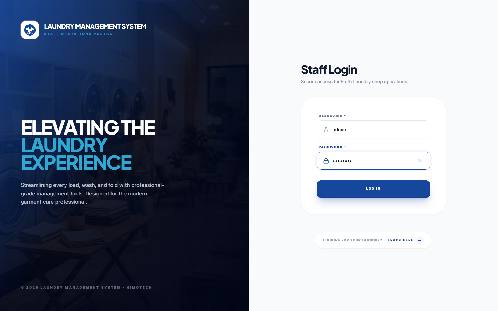 | 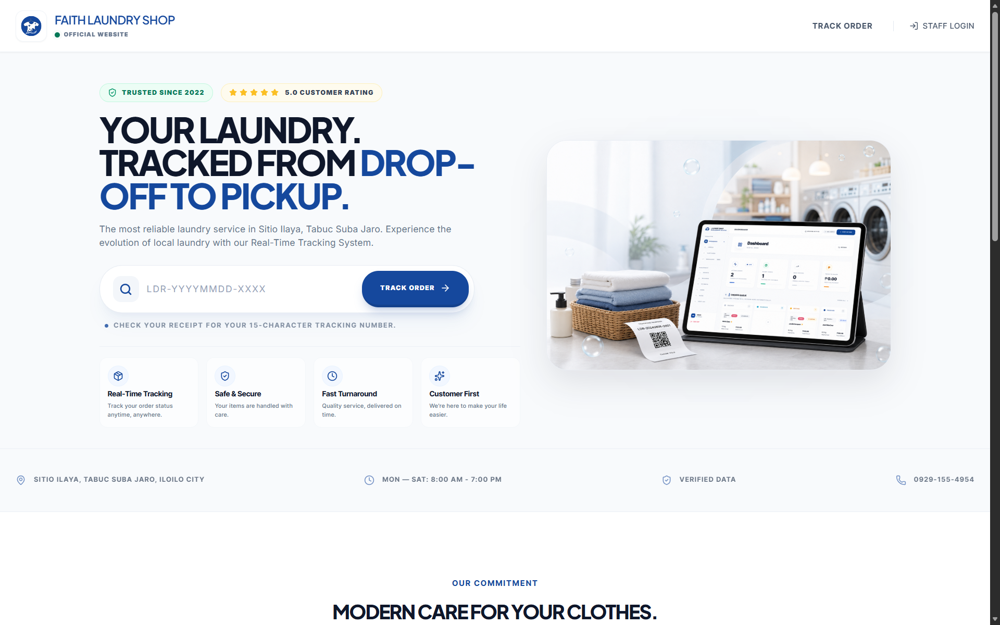 |
| **Staff Login** — JWT auth with attempt rate limiting | **Landing Portal** — Customer-facing homepage |
| 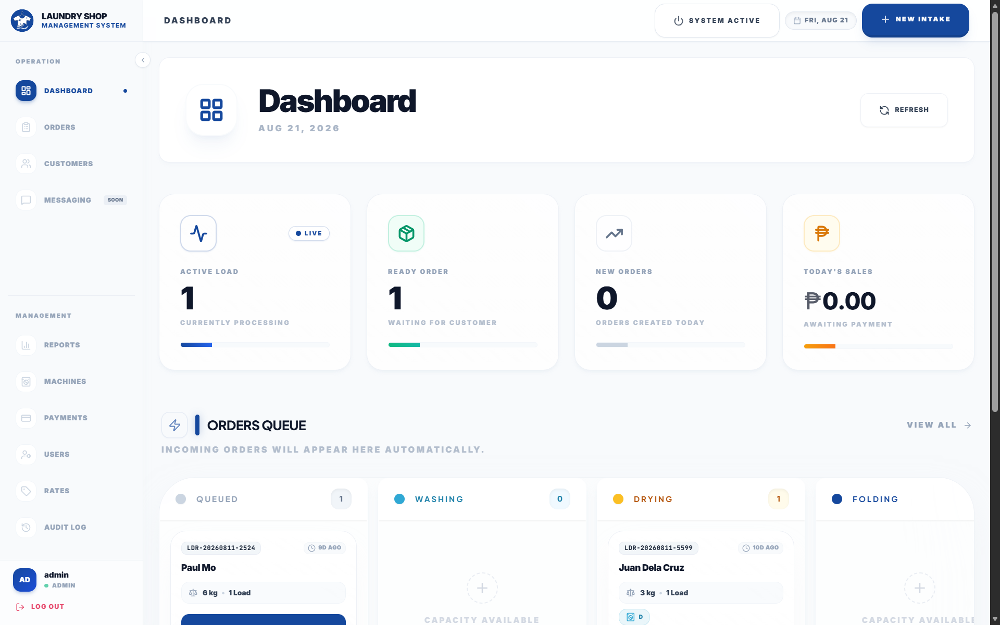 | 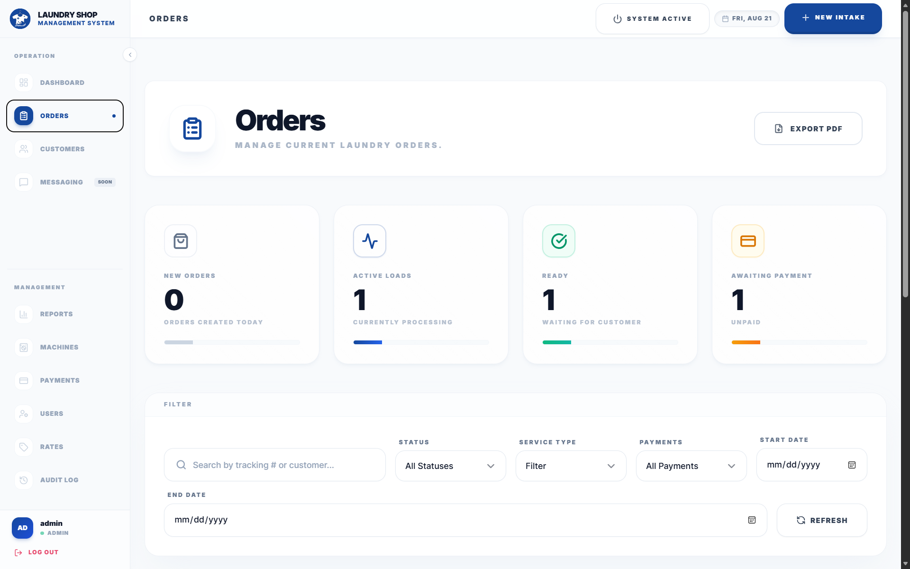 |
| **Dashboard** — Operational overview & Kanban pipeline | **Orders List** — Filterable order records |
| 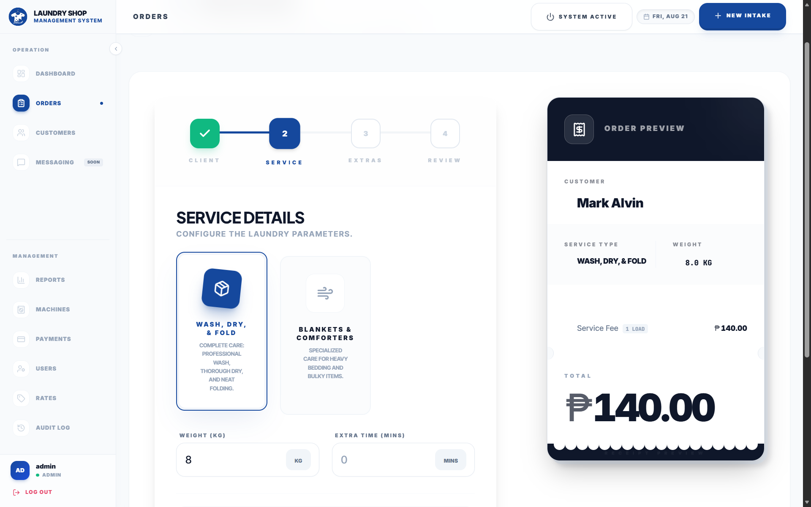 | 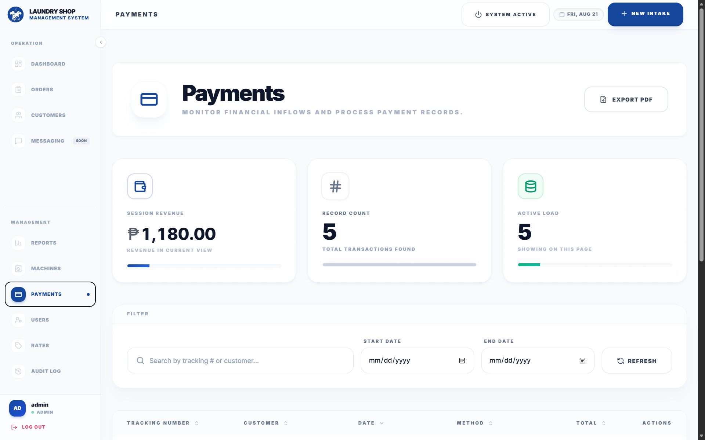 |
| **Order Intake** — Multi-step wizard with real-time pricing | **Payments Ledger** — Payment reconciliation |
| 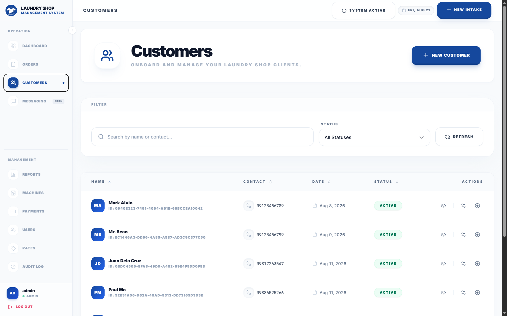 | 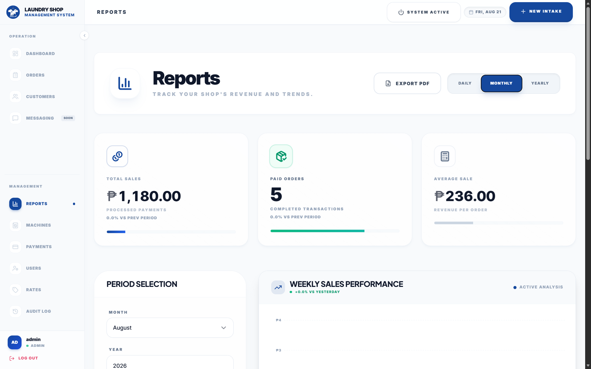 |
| **Customers** — Customer directory & visit history | **Sales Reports** — Daily, monthly, and yearly income summaries |
| 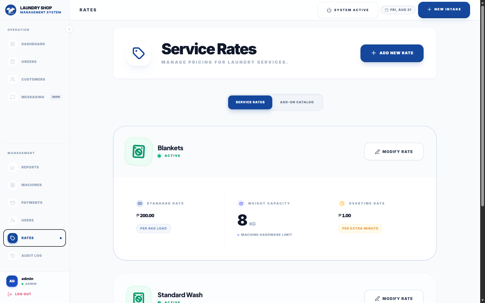 | 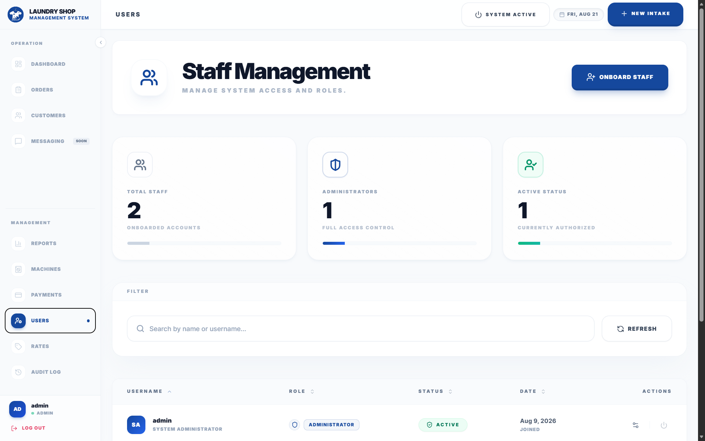 |
| **Service Rates** — Configurable load and add-on pricing | **Users** — Role-based access control (Admin / Staff) |
| 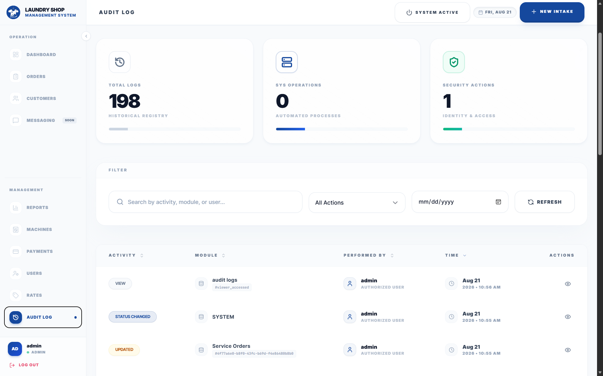 | 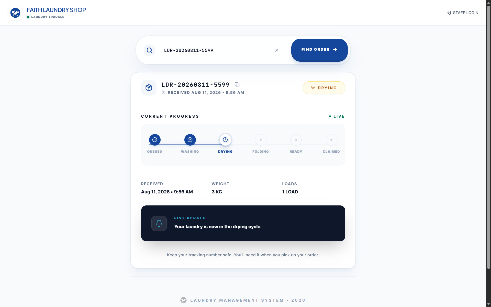 |
| **Audit Logs** — Database-triggered activity records | **Public Tracking** — Receipt QR scan to live progress |

</div>

---

## Features

### 🧺 Order Management & Intake
- Multi-step intake wizard: customer search or registration, weight entry, service selection, machine allocation, and add-on services (detergent, fabric softener).
- **Price snapshotting**: Base rates and add-on unit prices are copied directly onto the order record at intake time, ensuring future price adjustments never alter historical financial reports.
- Reference number generator (`LDR-YYYYMMDD-XXXX`) and printable receipt with barcode and tracking QR code.

### 🔄 6-Stage Order Pipeline
- Status progression: **Received → Washing → Drying → Folding → Ready for Pickup → Released**.
- Release restriction: The system prevents staff from releasing laundry until the balance is fully paid.
- Visual Kanban board on the dashboard for quick floor-status overview.

### 🖥️ Machine Availability Tracking
- Real-time status for washers and dryers (Available, In Use, Maintenance, Down).
- Intake wizard checks active assignments to prevent assigning loads to occupied machines.

### 📱 Customer Tracking Portal
- Deployed on **[Vercel](https://laundry-shop-management-system.vercel.app)** for public mobile access.
- Customers scan the QR code on their printed receipt to view real-time stage progress without login credentials or exposure of customer personal data.

### 💳 Payment Processing & Sales Reports
- Single and split payments (Cash, GCash, Bank Transfer).
- Daily, monthly, and annual revenue breakdowns with visual charts.

### 💻 Standalone Windows Installer
- Single `.exe` installer created via Inno Setup (`scripts/installer.iss`).
- Silently provisions PostgreSQL as a local service, installs WinSW background wrapper, and configures production properties without requiring manual Node.js or Java installs on the counter machine.

---

## Tech Stack

| Layer | Technology | Details |
|:---|:---|:---|
| **Frontend** | Next.js 15, React 19, TypeScript, Tailwind CSS | App Router, responsive tables, Framer Motion animations |
| **Backend** | Spring Boot 3.5, Java 21 LTS | REST API, Spring Security, JWT auth, Flyway migrations |
| **Database** | PostgreSQL 16 | Relational schema, `pgcrypto` UUIDs, JSON audit triggers |
| **Desktop Installer** | Inno Setup & WinSW | Standalone Windows service packaging for counter PC |
| **Public Hosting** | Vercel | Auto-deploys public customer tracking portal |
| **Testing** | JUnit 5, Testcontainers, Vitest | 199 backend tests against real PostgreSQL + 90 frontend tests |

---

## Architecture

```
┌─────────────────────────────────────────┐
│          Next.js 15 (Frontend)          │
│  React · TypeScript · Tailwind CSS      │
│  App Router · Responsive UI             │
│                                         │
│  ┌─────────────────────────────────┐    │
│  │  (public)/track  ←── QR Scan    │    │  Public Vercel deployment
│  │  (auth)/login                   │    │  (Customer status tracking)
│  │  (dashboard)/*  (JWT-protected) │    │
│  └─────────────────────────────────┘    │
└──────────────────┬──────────────────────┘
                   │ REST / JSON
                   ▼
┌─────────────────────────────────────────┐
│         Spring Boot 3.5 (Backend)       │
│  Java 21 · JWT Auth · RBAC             │
│  Business rules & pricing engine        │
│  Checkstyle · OpenAPI (Swagger)         │
│                                         │
│  Package structure:                     │
│  orders/ machines/ payments/ reports/   │
│  customers/ auth/ users/ rates/         │
│  auditlog/ clientalert/ config/         │
└──────────────────┬──────────────────────┘
                   │ JDBC / Flyway
                   ▼
┌─────────────────────────────────────────┐
│          PostgreSQL 16 (Database)       │
│  Flyway schema versioning               │
│  Audit triggers (fn_audit_log)          │
│  JSON diffs & price snapshot records    │
└─────────────────────────────────────────┘
```

---

## Getting Started

### Prerequisites

- [Docker Desktop](https://www.docker.com/products/docker-desktop) or local PostgreSQL 16
- [Java JDK 21 LTS](https://adoptium.net/)
- [Node.js 20+ LTS](https://nodejs.org/)

> Maven is included via the project wrapper (`./mvnw` / `mvnw.cmd`) — no standalone install needed.

### Running Locally (Hybrid Mode)

```bash
# 1. Clone repository and set up environment
git clone https://github.com/markalvincadangin/laundry-shop-management-system.git
cd laundry-shop-management-system
cp .env.example .env

# 2. Start PostgreSQL container
docker compose up -d db

# 3. Start Spring Boot Backend (Terminal 1)
export $(grep -v '^#' .env | xargs) && cd backend && ./mvnw spring-boot:run

# 4. Start Next.js Frontend (Terminal 2)
cd frontend
cp .env.local.example .env.local
npm install && npm run dev
```

### Local URLs

| Service | URL | Description |
|:---|:---|:---|
| **Frontend UI** | [http://localhost:3000](http://localhost:3000) | Staff dashboard & public portal |
| **Backend API** | [http://localhost:8080/api/v1/health](http://localhost:8080/api/v1/health) | API health check endpoint |
| **Swagger UI** | [http://localhost:8080/swagger-ui.html](http://localhost:8080/swagger-ui.html) | Interactive OpenAPI documentation |
| **Public Tracking** | [https://laundry-shop-management-system.vercel.app](https://laundry-shop-management-system.vercel.app) | Public live tracking portal |

---

## Project Structure

```
laundry-shop-management-system/
├── backend/                              # Spring Boot application (Java 21)
│   └── src/main/java/com/himotech/laundryms/
│       ├── auth/                         # JWT authentication & rate limiting
│       ├── orders/                       # Order creation, pricing rules, status pipeline
│       ├── machines/                     # Washer & dryer status tracking
│       ├── customers/                    # Customer records & history
│       ├── payments/                     # Payment transactions & ledger
│       ├── rates/                        # Configurable service pricing
│       ├── reports/                      # Daily/monthly sales aggregation
│       ├── auditlog/                     # Database-level audit records
│       ├── clientalert/                  # Customer notification queue
│       ├── users/                        # Staff & admin account management
│       └── config/                       # Security, CORS, Swagger config
├── frontend/                             # Next.js 15 client
│   └── src/
│       ├── app/
│       │   ├── (auth)/login/             # Staff login
│       │   ├── (dashboard)/              # Protected operational views
│       │   └── (public)/                 # Landing page & QR order tracking
│       ├── components/features/          # Feature-scoped components
│       └── lib/api/                      # Typed API client
├── scripts/                              # Deployment & installer scripts
│   ├── installer.iss                     # Inno Setup Windows script
│   ├── build-deployment.sh               # Build payload packaging
│   └── build-installer.ps1               # Installer compiler (PowerShell)
├── docs/                                 # Capstone documentation & specs
│   ├── 00-context/case-study.md          # Business background & interview notes
│   ├── 02-requirements/business-rules.md # Canonical business rules
│   └── 05-tech-design/openapi.yaml       # OpenAPI 3.0 specification
└── docker-compose.yml                    # Local database orchestration
```

---

## Testing

```bash
# Run backend tests (JUnit 5 + Testcontainers with real PostgreSQL)
cd backend && ./mvnw test

# Run frontend unit tests (Vitest + React Testing Library)
cd frontend && npm test
```

| Test Suite | Test Count | Scope |
|:---|:---:|:---|
| **Backend (JUnit 5 + Testcontainers)** | **199 tests** | Order pipelines, pricing logic, JWT security, payment recording, machine constraints |
| **Frontend (Vitest)** | **90 tests** | Intake wizard, status components, API client validation, form schemas |
| **Total Automated Tests** | **289 tests** | Verified passing |

---

## Why I Built It This Way

- **Why price snapshots instead of calculating totals on the fly from current rates?**  
  In a small business, pricing changes periodically (e.g. soap or electricity costs rise). If the database only stores the service ID and computes totals dynamically from current rates, historical reports will retroactively alter revenue numbers whenever rates are updated. Storing snapshotted rates on the order row preserves historical financial accuracy.

- **Why a Windows installer instead of purely hosting it on the cloud?**  
  Small neighborhood laundry shops often operate on tight budgets with inconsistent internet connections. Having a standalone Windows installer that sets up a local PostgreSQL service allows the shop to operate locally at the counter regardless of internet outages, while the lightweight public tracking portal runs on Vercel for customer receipt scans.

- **Why zero-login QR code tracking for customers?**  
  Laundry customers do not want to download an app or create an account just to check if their clothes are dry. Printing a unique URL and QR code on the physical thermal receipt lets them scan with their phone camera and see the exact stage of their order instantly.

---

## Documentation

Full capstone deliverables and design specifications are maintained in [`docs/`](docs/):
- [**Case Study & Interview**](docs/00-context/case-study.md) — Stakeholder interview with the shop owner
- [**Business Rules Specification**](docs/02-requirements/business-rules.md) — Pricing calculations and status transition rules
- [**User Stories**](docs/02-requirements/user-stories.md) — Functional requirement stories
- [**OpenAPI Specification**](docs/05-tech-design/openapi.yaml) — Complete REST endpoint contract
- [**Architecture Document**](docs/05-tech-design/architecture.md) — Component architecture and packaging

---

## Author

**Mark Alvin Cadangin**  
Software Development Technologies — West Visayas State University  
GitHub: [@markalvincadangin](https://github.com/markalvincadangin)

---

## License

Developed as an academic capstone project for the Systems Analysis and Design course at West Visayas State University. All rights reserved.
