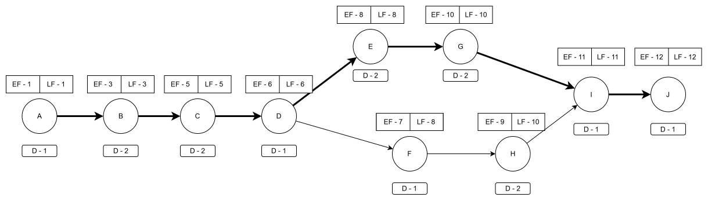

# Project Schedule
## Faith Laundry Shop Management System

> **Client:** Faith Laundry Shop  
> **Prepared By:** HIMÓTECH  
> **Document ID:** PS-001  
> **Version:** 1.0  
> **Date:** 2026-02-12  
> **Purpose:** Outline project schedule, task dependencies, and critical path  
> **Status:** Baseline

---

## Document Control
- **Document Type:** Project Schedule
- **Related Documents:** [Work Breakdown Structure (WBS-001)](5-wbs.md)
- **Confidentiality:** Internal / Academic Use

---

## 1. Purpose

This document outlines the project schedule, task dependencies, and critical path for the development of the Faith Laundry Shop Management System. It utilizes a Gantt Chart for chronological visualization and a PERT/CPM matrix to identify the sequence of crucial activities required to complete the project within the 12-week academic term.

## 2. Activity Mapping

The following table defines the major project activities used in the scheduling diagrams and maps them directly to the specific deliverables outlined in the Work Breakdown Structure (WBS).

| Activity ID | Activity Description                 | WBS Reference           |
|-------------|--------------------------------------|-------------------------|
| **A**       | Initial Planning & Case Study        | 1.1, 1.2                |
| **B**       | Charter & Objectives Definition      | 1.3, 1.4, 1.5           |
| **C**       | Requirements Identification          | 2.1, 2.2, 2.3           |
| **D**       | Data/Process Modeling & Validation   | 2.4, 2.5, 2.6, 2.7      |
| **E**       | Database & Architecture Design       | 3.1, 3.3, 3.4           |
| **F**       | Interface Design (UI Mockups)        | 3.2                     |
| **G**       | Database & Backend Development       | 4.1, 4.2                |
| **H**       | Frontend Development                 | 4.3                     |
| **I**       | Integration & Testing                | 4.4, 5.1, 5.2, 5.3, 5.4 |
| **J**       | Deployment & Closure                 | 6.1, 6.2, 6.3, 6.4, 7.1, 7.2, 7.3 |

## 3. PERT/CPM Analysis

The Expected Duration is calculated in Weeks. The mathematical logic below ensures milestones are met: Planning (Week 3), Requirements (Week 6), Design (Week 8), Development (Week 10), and Deployment (Week 12).

| Activity | Preceding Event | Expected Duration | EF | LF | Slack | Critical Path? |
|----------|-----------------|-------------------|----|----|-------|----------------|
| A        | -               | 1                 | 1  | 1  | 0     | Y              |
| B        | A               | 2                 | 3  | 3  | 0     | Y              |
| C        | B               | 2                 | 5  | 5  | 0     | Y              |
| D        | C               | 1                 | 6  | 6  | 0     | Y              |
| E        | D               | 2                 | 8  | 8  | 0     | Y              |
| F        | D               | 1                 | 7  | 8  | 1     | N              |
| G        | E               | 2                 | 10 | 10 | 0     | Y              |
| H        | F               | 2                 | 9  | 10 | 1     | N              |
| I        | G, H            | 1                 | 11 | 11 | 0     | Y              |
| J        | I               | 1                 | 12 | 12 | 0     | Y              |

## 4. Gantt Chart

The timeline below illustrates the planned progression of activities across the 12-week schedule.

| Activity | W1  | W2  | W3  | W4  | W5  | W6  | W7  | W8  | W9  | W10 | W11 | W12 |
|----------|-----|-----|-----|-----|-----|-----|-----|-----|-----|-----|-----|-----|
| **A**    | █   |     |     |     |     |     |     |     |     |     |     |     |
| **B**    |     | █   | █   |     |     |     |     |     |     |     |     |     |
| **C**    |     |     |     | █   |  █  |     |     |     |     |     |     |     |
| **D**    |     |     |     |     |     |  █  |     |     |     |     |     |     |
| **E**    |     |     |     |     |     |     |  █  |  █  |     |     |     |     |
| **F**    |     |     |     |     |     |     |  █  |     |     |     |     |     |
| **G**    |     |     |     |     |     |     |     |     |  █  |  █  |     |     |
| **H**    |     |     |     |     |     |     |     |  █  |  █  |     |     |     |
| **I**    |     |     |     |     |     |     |     |     |     |     |  █  |     |
| **J**    |     |     |     |     |     |     |     |     |     |     |     |  █  |
