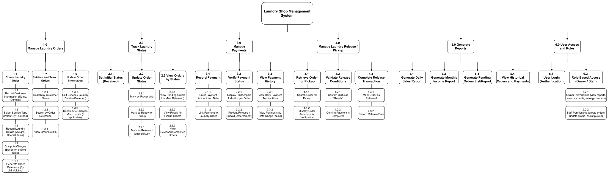

# Functional Decomposition Diagram (FDD)
## Faith Laundry Shop Management System

> **Client:** Faith Laundry Shop  
> **Prepared By:** HIMÓTECH  
> **Document ID:** FDD-001  
> **Version:** 1.0  
> **Date:** 2026-02-16  
> **Purpose:** Illustrate the top-down breakdown of system functions  
> **Status:** Baseline

---

## Document Control
- **Document Type:** Functional Decomposition Diagram
- **Confidentiality:** Internal / Academic Use

---

## 1. Overview

The Functional Decomposition Diagram (FDD) provides a top-down view of the Laundry Shop Management System's functions. It visually breaks down the overall system into smaller, manageable subsystems such as Order Management, Inventory, Sales & Reporting, and User Management.

## 2. Diagram

