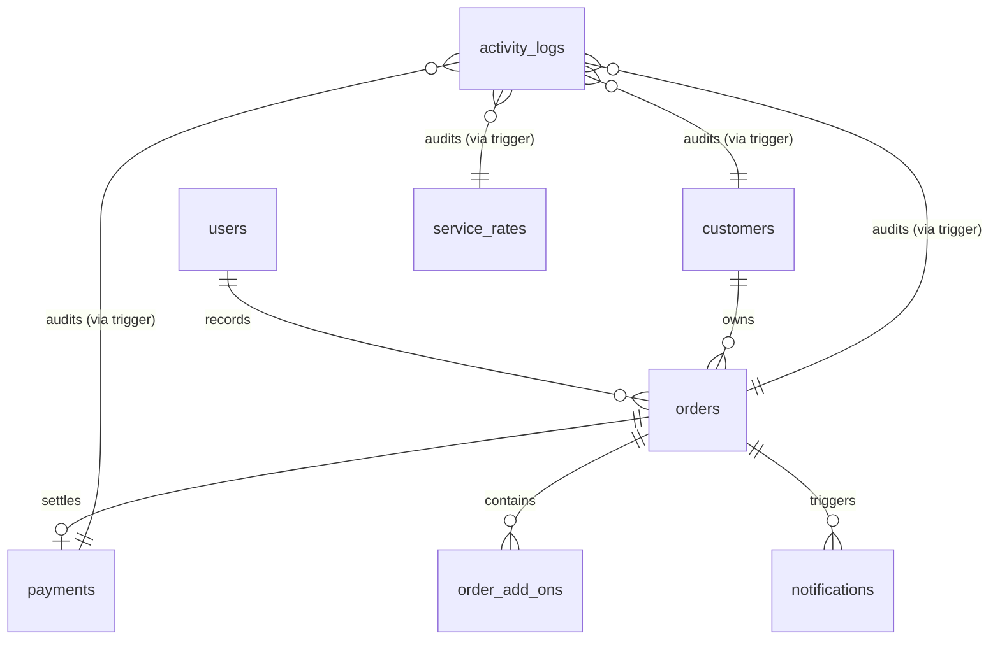

# Master Database Schema
## Faith Laundry Shop Management System

> **Client:** Faith Laundry Shop  
> **Prepared By:** HIMÓTECH  
> **Document ID:** DATA-002  
> **Version:** 2.0  
> **Date:** 2026-04-26  
> **Purpose:** Canonical reference for the finalized database schema, including indexing strategies and technical standards  
> **Status:** Updated — Synced with Flyway V1__init.sql

---

## Document Control
- **Document Type:** Technical Specification — Data Schema
- **Related Documents:** [Data Design Notes (DATA-001)](./data-notes.md), [ERD (erd.dbml)](./erd.dbml), [Consolidated Schema (schema.sql)](./schema.sql), [Flyway V1 Migration](../../backend/src/main/resources/db/migration/V1__init.sql)
- **Confidentiality:** Internal / Academic Use

### Revision History
| Version | Date       | Author   | Changes |
|---------|------------|----------|---------|
| 1.0     | 2026-04-25 | HIMÓTECH  | Initial baseline; standardized for JPA/PostgreSQL compatibility |
| 2.0     | 2026-04-26 | HIMÓTECH  | Synced with V1__init.sql: added `activity_logs`, removed `order_status_logs`, added `notifications.is_read`, added `customers.is_active`, documented triggers and functions |

---

## 1. Introduction

This document serves as the canonical source of truth for the Faith Laundry Shop Management System database. It defines the finalized table structures, data types, integrity constraints, and performance strategies required to support the system's business rules and user stories.

The schema uses a **hybrid forensic audit architecture**: 
1. **Database-level triggers** (`fn_audit_activity`) automatically record all raw INSERT/UPDATE/DELETE data mutations into a central `activity_logs` table.
2. **Application-level aspects** (`AuditAspect`) record high-level intent, context (IP Address, User Agent), and outcome (Success/Failure) into the same unified log.

---

## 2. Technical Standards

### 2.1 Enum Implementation (VARCHAR Standardization)
To ensure seamless compatibility between the Java/JPA layer and PostgreSQL, all enums are implemented as `VARCHAR` in the database. This prevents type-casting conflicts during runtime and simplifies schema evolution.

**Standardized Enums & Lengths:**
- **UserRole:** `ADMIN`, `STAFF` (VARCHAR(30))
- **OrderStatus:** `RECEIVED`, `WASHING`, `DRYING`, `FOLDING`, `READY_FOR_PICKUP`, `RELEASED`, `CANCELLED` (VARCHAR(30))
- **PaymentStatus:** `UNPAID`, `PAID` (VARCHAR(30))
- **PaymentMethod:** `CASH`, `GCASH`, `BANK_TRANSFER` (VARCHAR(30))
- **NotificationStatus:** `PENDING`, `SENT`, `FAILED` (VARCHAR(30))
- **NotificationChannel:** `SMS`, `IN_APP` (VARCHAR(30))
- **ActivityAction:** `INSERT`, `UPDATE`, `DELETE`, `USER_LOGIN`, `ORDER_CREATE`, `ORDER_STATUS_UPDATE`, `PAYMENT_RECORD`, `PAYMENT_VOID` (VARCHAR(30))

### 2.2 Numerical Precision
- **Monetary Fields:** Use `decimal(10,2)` to ensure exact financial calculations.
- **Weight Fields:** Use `decimal(10,2)` or `decimal(5,2)` for measurement accuracy.

---

## 3. Core Table Definitions

### 3.1 Users (`users`)
| Column | Type | Nullable | Purpose |
|--------|------|----------|---------|
| `id` | `UUID` | No | PK; generated via `gen_random_uuid()` |
| `username` | `VARCHAR(50)` | No | Unique login identifier |
| `password_hash`| `VARCHAR` | No | BCrypt hash |
| `role` | `VARCHAR(30)` | No | ADMIN or STAFF |
| `first_name` | `VARCHAR(100)` | No | |
| `last_name` | `VARCHAR(100)` | No | |
| `is_active` | `BOOLEAN` | No | Soft delete |
| `created_at` | `TIMESTAMP` | No | |
| `updated_at` | `TIMESTAMP` | No | Auto-updated via `trg_users_updated_at` trigger |

### 3.2 Customers (`customers`)
| Column | Type | Nullable | Purpose |
|--------|------|----------|---------|
| `id` | `BIGSERIAL` | No | PK; auto-incrementing |
| `first_name` | `VARCHAR(100)` | No | |
| `last_name` | `VARCHAR(100)` | No | |
| `contact_number`| `VARCHAR(20)` | No | Validated via regex CHECK |
| `is_active` | `BOOLEAN` | No | Soft delete flag |
| `created_at` | `TIMESTAMP` | No | |
| `updated_at` | `TIMESTAMP` | No | Auto-updated via `trg_customers_updated_at` trigger |

> **Constraints:** UNIQUE(last_name, first_name, contact_number), CHECK(contact_number format)

### 3.3 Service Rates (`service_rates`)
| Column | Type | Nullable | Purpose |
|--------|------|----------|---------|
| `id` | `SERIAL` | No | PK |
| `service_name` | `VARCHAR(100)` | No | Unique name (e.g., "Standard Wash") |
| `base_price_per_load` | `DECIMAL(10,2)` | No | ₱120 default (BR-PR-01) |
| `kg_limit_per_load` | `DECIMAL(5,2)` | No | 8 kg default (BR-PR-01) |
| `price_per_extra_minute` | `DECIMAL(10,2)` | No | ₱1 default (BR-PR-03) |
| `is_active` | `BOOLEAN` | No | Active rate flag |
| `created_at` | `TIMESTAMP` | No | |
| `updated_at` | `TIMESTAMP` | No | Auto-updated via `trg_service_rates_updated_at` trigger |

### 3.4 Orders (`orders`)
| Column | Type | Nullable | Purpose |
|--------|------|----------|---------|
| `id` | `BIGSERIAL` | No | PK |
| `reference_number`| `VARCHAR(30)`| No | Unique tracking ID (CHECK: LDR-YYYYMMDD-XXXX) |
| `customer_id` | `BIGINT` | No | FK to customers |
| `created_by_user_id`| `UUID` | No | FK to users |
| `service_rate_id`| `INT` | No | FK to service_rates |
| `weight_kg` | `DECIMAL(10,2)`| No | CHECK > 0 |
| `total_loads` | `INT` | No | Snapshot; CHECK > 0 |
| `base_price_per_load`| `DECIMAL(10,2)`| No | Snapshot |
| `kg_limit_per_load`| `DECIMAL(5,2)` | No | Snapshot |
| `price_per_extra_minute`| `DECIMAL(10,2)`| No | Snapshot |
| `extra_minutes` | `INT` | No | |
| `base_amount` | `DECIMAL(10,2)`| No | |
| `extra_minutes_amount`| `DECIMAL(10,2)`| No | |
| `addons_total_amount`| `DECIMAL(10,2)`| No | |
| `grand_total` | `DECIMAL(10,2)`| No | Snapshot; CHECK >= 0 |
| `current_status` | `VARCHAR(30)` | No | Lifecycle stage (BR-OL-03) |
| `payment_status` | `VARCHAR(30)` | No | UNPAID/PAID |
| `created_at` | `TIMESTAMP` | No | |
| `updated_at` | `TIMESTAMP` | No | Auto-updated via `trg_orders_updated_at` trigger |

### 3.5 Order Add-Ons (`order_add_ons`)
| Column | Type | Nullable | Purpose |
|--------|------|----------|---------|
| `id` | `BIGSERIAL` | No | PK |
| `order_id` | `BIGINT` | No | FK to orders (CASCADE DELETE) |
| `name` | `VARCHAR(100)` | No | e.g., "Fabric Conditioner" |
| `price` | `DECIMAL(10,2)` | No | CHECK >= 0 |
| `quantity` | `INT` | No | CHECK > 0 |

### 3.6 Payments (`payments`)
| Column | Type | Nullable | Purpose |
|--------|------|----------|---------|
| `id` | `BIGSERIAL` | No | PK |
| `order_id` | `BIGINT` | No | FK to orders (UNIQUE; 1:1 enforcement) |
| `amount_paid` | `DECIMAL(10,2)` | No | CHECK > 0; must equal grand_total (BR-PAY-03) |
| `payment_method` | `VARCHAR(30)` | No | CASH, GCASH, BANK_TRANSFER |
| `received_by_user_id` | `UUID` | No | FK to users |
| `payment_date` | `TIMESTAMP` | No | |
| `remarks` | `TEXT` | Yes | |

### 3.7 Notifications (`notifications`)
| Column | Type | Nullable | Purpose |
|--------|------|----------|---------|
| `id` | `BIGSERIAL` | No | PK |
| `order_id` | `BIGINT` | No | FK to orders (CASCADE DELETE) |
| `channel` | `VARCHAR(30)` | No | SMS or IN_APP |
| `message` | `TEXT` | No | |
| `created_at` | `TIMESTAMP` | No | |
| `sent_at` | `TIMESTAMP` | Yes | Null until sent |
| `status` | `VARCHAR(30)` | No | PENDING, SENT, FAILED |
| `is_read` | `BOOLEAN` | No | In-app read status; default FALSE |

> **Note:** `customer_id` removed for 3NF compliance — derivable via `order_id → orders.customer_id`.

### 3.8 Activity Logs (`activity_logs`)
| Column | Type | Nullable | Purpose |
|--------|------|----------|---------|
| `id` | `BIGSERIAL` | No | PK |
| `user_id` | `VARCHAR(255)` | Yes | User captured from `app.current_user_id` session variable (set by Spring AOP) |
| `action_type` | `VARCHAR(10)` | No | `INSERT`, `UPDATE`, or `DELETE` |
| `table_name` | `VARCHAR(100)` | No | Affected table |
| `record_id` | `VARCHAR(255)` | No | Affected record's `id` value |
| `old_data` | `JSONB` | Yes | Full row snapshot before change (Trigger-based updates) |
| `new_data` | `JSONB` | Yes | Full row snapshot after change (Trigger-based updates) |
| `ip_address` | `VARCHAR(45)` | Yes | Originating IP (captured by Spring AOP) |
| `user_agent` | `TEXT` | Yes | Device/Browser info (captured by Spring AOP) |
| `status` | `VARCHAR(20)` | Yes | `SUCCESS` or `FAILURE` |
| `method_name`| `VARCHAR(255)` | Yes | Exact service method executed |
| `description`| `TEXT` | Yes | Human-readable intent |
| `created_at` | `TIMESTAMP` | No | Event timestamp |

> **Design:** Populated by a combination of the `fn_audit_activity()` database trigger (for data-level mutations) and the `AuditAspect` application aspect (for context-level actions). Active on: `orders`, `payments`, `customers`, `service_rates`, and authentication events.

---

## 4. Shared Functions & Triggers

### 4.1 Timestamp Maintenance (`set_updated_at`)
A single `set_updated_at()` PL/pgSQL function is applied via `BEFORE UPDATE` triggers to all tables with an `updated_at` column:

| Trigger | Table |
|---------|-------|
| `trg_service_rates_updated_at` | `service_rates` |
| `trg_users_updated_at` | `users` |
| `trg_customers_updated_at` | `customers` |
| `trg_orders_updated_at` | `orders` |

### 4.2 Forensic Audit (`fn_audit_activity`)
A single `fn_audit_activity()` PL/pgSQL function is applied via `AFTER INSERT OR UPDATE OR DELETE` triggers on all audited tables:

| Trigger | Table |
|---------|-------|
| `trg_audit_orders` | `orders` |
| `trg_audit_payments` | `payments` |
| `trg_audit_service_rates` | `service_rates` |
| `trg_audit_customers` | `customers` |

The function reads `app.current_user_id` from the PostgreSQL session context — this value is set by a Spring Boot AOP aspect before each write operation.

---

## 5. Performance & Indexing Strategy

To ensure sub-second response times for the Staff Dashboard, Activity Log, and Customer Tracking Portal, the following indices are enforced:

1. **`idx_activity_logs_table_record`**: Composite index on `activity_logs(table_name, record_id)` — fast entity-level audit history.
2. **`idx_activity_logs_created_at`**: Descending index on `activity_logs(created_at)` — chronological log browsing.
3. **`idx_payments_date`**: B-Tree index on `payments(payment_date)` — reporting speed.
4. **`idx_orders_customer_created`**: Composite index on `orders(customer_id, created_at DESC)` — customer order history.
5. **`idx_orders_status`**: Index on `orders(current_status)` — dashboard filtering.
6. **`idx_orders_payment_status`**: Index on `orders(payment_status)` — dashboard filtering.

---

## 6. Entity Relationship Diagram

---

## 7. Conclusion

The Master Schema provides the structural foundation for the Faith Laundry Shop Management System. It enforces the business logic defined in the [Business Rules](../02-requirements/business-rules.md) and provides a high-performance, forensically auditable environment for day-to-day operations.
