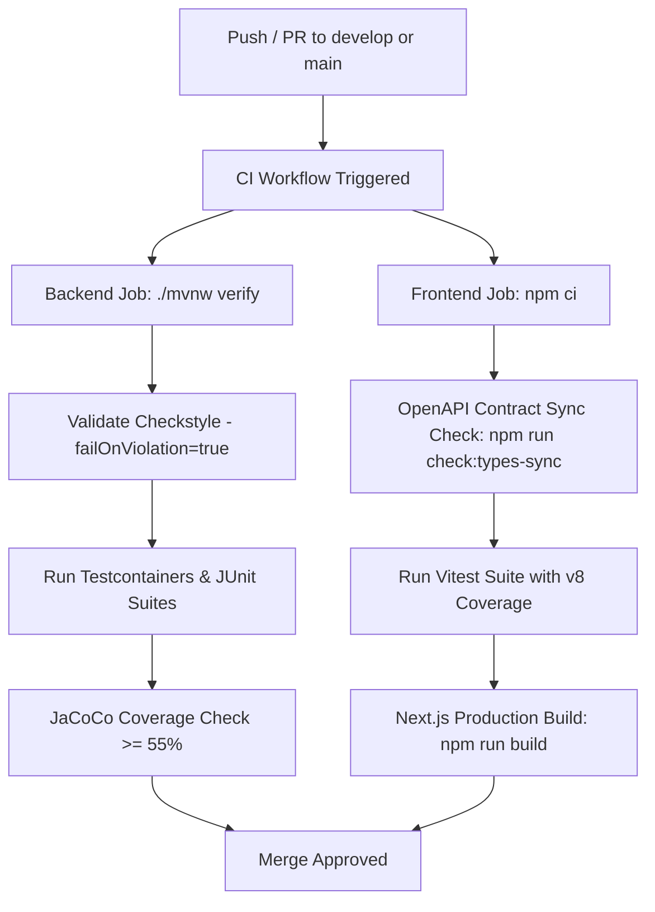

# Test Traceability Matrix
## Laundry Shop Management System

> **Author & Developer:** Mark Alvin Cadangin  
> **Document ID:** TEST-MATRIX-001  
> **Version:** 1.0.0  
> **Date:** 2026-07-25  
> **Purpose:** Map every business rule (BR-xx) and user story (US-xx) to automated test suites across the full stack.

---

## 1. Business Rules Coverage Matrix

| Rule ID | Rule Summary | Primary Enforcement Layer | Backend Test Suite | Frontend / Schema Test Suite | Status |
|---|---|---|---|---|---|
| **BR-PR-01** | Base load pricing & weight limit ceiling per active service rate | `OrderService` | `OrderServiceTest` (`CreatePricing`) | `IntakeWizard.test.tsx` | ✅ Covered |
| **BR-PR-02** | Additional load calculation `ceil(weight / kg_limit)` for excess weight | `OrderService` | `OrderServiceTest` (`createShouldcomputetotalloads...`) | `OrderIntakeSchema` test | ✅ Covered |
| **BR-PR-03** | Extra washing time charge `extra_minutes × price_per_extra_minute` | `OrderService` | `OrderServiceTest` (`createShouldcomputextraWashingTime...`) | `IntakeServiceStepSchema` test | ✅ Covered |
| **BR-PR-04** | Optional add-on charges (e.g. fabric conditioner, rush fee) | `OrderService` | `OrderServiceTest` (`createShouldaddRushFee...`) | `IntakeExtrasStepSchema` test | ✅ Covered |
| **BR-PR-05** | Admin dynamic control over active service rates | `ServiceRateService` | `ServiceRateServiceTest`, `ServiceRatesControllerTest` | `usePriceCalculation` test | ✅ Covered |
| **BR-PR-06** | Special Rush order pricing calculation | `OrderService` | `OrderServiceTest` (`createShouldaddRushFee...`) | `IntakeWizard.test.tsx` | ✅ Covered |
| **BR-OL-01** | Unique tracking number format (`LDR-YYYYMMDD-XXXX`) | `OrderService` | `OrderServiceTest` (`createShouldgenerateuniquereference...`) | `api.test.ts` | ✅ Covered |
| **BR-OL-02** | Initial order status MUST be `RECEIVED` | `OrderService` | `OrderServiceTest` (`createShouldpersistorderWhenvalidcommand`) | `OrderPipeline.test.tsx` | ✅ Covered |
| **BR-OL-03** | Enforced 6-stage lifecycle progression | `OrderStatusService` | `OrderStatusServiceTest` (`shouldAdvanceStatus...`) | `ProcessStepper.test.tsx` | ✅ Covered |
| **BR-OL-04** | Status change auditing & timestamping | `OrderStatusService` | `OrderStatusServiceTest`, `AuditLogPerformanceTest` | N/A (Backend trigger) | ✅ Covered |
| **BR-OL-05** | Order release precondition (`READY_FOR_PICKUP` + `PAID`) | `OrderStatusService` | `OrderStatusServiceTest` (`shouldRejectReleaseWhenUnpaid`) | `OrderCard.test.tsx` | ✅ Covered |
| **BR-OL-06** | Order cancellation restrictions & payment voiding | `OrderStatusService` | `OrderStatusServiceTest` (`shouldCancelOrder...`) | `orders/[id]/page.test.tsx` | ✅ Covered |
| **BR-PAY-01** | Payment amount MUST equal grand total (or valid partial amount) | `PaymentService` | `PaymentServiceTest` (`shouldRecordFullPayment`) | `orders/[id]/pay/page.test.tsx` | ✅ Covered |
| **BR-PAY-02** | Single full payment transitions status to `PAID` | `PaymentService` | `PaymentServiceTest` (`shouldUpdatePaymentStatusToPaid`) | `orders/[id]/pay/page.test.tsx` | ✅ Covered |
| **BR-PAY-03** | Rejection of invalid payment amounts or double payment | `PaymentService` | `PaymentServiceTest` (`shouldThrowConflictOnDuplicatePayment`) | `orders/[id]/pay/page.test.tsx` | ✅ Covered |
| **BR-PAY-04** | Payment recording requires recorder user attribution | `PaymentService` | `PaymentServiceTest` (`shouldSetRecordedBy`) | `orders/[id]/pay/page.test.tsx` | ✅ Covered |
| **BR-PAY-05** | Voiding/Refunding payments requires Admin role & audit log | `PaymentService` | `PaymentServiceTest` (`shouldVoidPayment`) | `payments/page.test.tsx` | ✅ Covered |
| **BR-PAY-06** | Supported payment methods (CASH, GCASH, BANK_TRANSFER) | `PaymentService` | `PaymentServiceTest` | `orders/[id]/pay/page.test.tsx` | ✅ Covered |
| **BR-PAY-07** | Income reports computed strictly from recorded payment data | `ReportsService` | `ReportsControllerTest` | `reports/page.test.tsx` | ✅ Covered |
| **BR-REC-01** | Core customer data requirements (firstName, lastName, contactNumber) | `CustomerService` | `CustomerServiceTest`, `CustomerRepositoryIT` | `customers/page.test.tsx` | ✅ Covered |
| **BR-REC-02** | Predictive customer search by name or contact number | `CustomerService` | `CustomerServiceTest` | `useCustomerLookup.test.tsx` | ✅ Covered |
| **BR-MAC-01** | Operational machine status management | `MachineService` | `MachineServiceTest` | `machines/page.test.tsx` | ✅ Covered |
| **BR-MAC-02** | Soft deletion of inactive machines | `MachineService` | `MachineServiceTest` (`shouldSoftDeleteMachine`) | `machines/page.test.tsx` | ✅ Covered |
| **BR-MAC-03** | Hoarding prevention — Machine assignment restrictions | `OrderStatusService` | `OrderStatusServiceTest` (`shouldAssignAvailableMachine`) | `IntakeWizard.test.tsx` | ✅ Covered |
| **BR-MAC-04** | Machine quantity capacity limit per shop | `MachineService` | `MachineServiceTest` (`shouldThrowExceptionWhenExceedingLimit`) | `machines/page.test.tsx` | ✅ Covered |

---

## 2. User Stories Coverage Matrix

| Story ID | User Story Summary | Backend Test Suite | Frontend Test Suite | Verification Status |
|---|---|---|---|---|
| **US-01** | Record Laundry Order | `OrderServiceTest`, `OrderControllerTest` | `IntakeWizard.test.tsx` | ✅ Verified |
| **US-02** | Automatically Compute Laundry Price | `OrderServiceTest` (`CreatePricing`) | `IntakeWizard.test.tsx` | ✅ Verified |
| **US-03** | Track Order Status Lifecycle | `OrderStatusServiceTest` | `OrderPipeline.test.tsx`, `ProcessStepper.test.tsx` | ✅ Verified |
| **US-04** | Track Order via Public Endpoint | `OrderControllerTest` (`publicTrack`) | `(public)/track/page.test.tsx` | ✅ Verified |
| **US-05** | Record Customer Payment | `PaymentServiceTest`, `PaymentControllerTest` | `orders/[id]/pay/page.test.tsx` | ✅ Verified |
| **US-06** | Enforce Release Preconditions | `OrderStatusServiceTest` | `OrderCard.test.tsx` | ✅ Verified |
| **US-07** | Generate Income Reports | `ReportsControllerTest` | `reports/page.test.tsx` | ✅ Verified |
| **US-08** | Customer Search & Registration | `CustomerServiceTest`, `CustomerControllerTest` | `customers/page.test.tsx` | ✅ Verified |
| **US-09** | Machine Operations & Status | `MachineServiceTest`, `MachineControllerTest` | `machines/page.test.tsx` | ✅ Verified |
| **US-10** | System Settings Management | `SystemSettingsRepositoryTest` | `settings/page.test.tsx` | ✅ Verified |
| **US-11** | Forensic Audit Trail Logging | `AuditLogPerformanceTest` | `audit/page.test.tsx` | ✅ Verified |
| **US-12** | Client Alerts / Escalation | `ClientAlertControllerTest` | `messaging/page.test.tsx` | ✅ Verified |
| **US-13** | Process Rush Orders | `OrderServiceTest` (`createShouldaddRushFee...`) | `IntakeWizard.test.tsx` | ✅ Verified |
| **US-14** | Manage Service Rates & Pricing | `ServiceRateServiceTest`, `ServiceRatesControllerTest` | `rates/page.test.tsx` | ✅ Verified |

---

## 3. Quality Gate Enforcements in CI/CD

1. **Checkstyle Strict Gate**: `<failOnViolation>true</failOnViolation>` ensures zero style or formatting regressions in backend code.
2. **JaCoCo Instruction Coverage Gate**: Configured at `0.55` (55% minimum) to ensure non-regression of backend business logic.
3. **OpenAPI Type Sync Gate**: Executed via `npm run check:types-sync` to verify that `docs/05-tech-design/openapi.yaml` and `frontend/src/types/api.generated.ts` are 100% identical.
4. **Vitest Unit & Integration Gate**: Executes 21 Vitest test suites verifying UI components, custom hooks, and Zod runtime schema validations.
