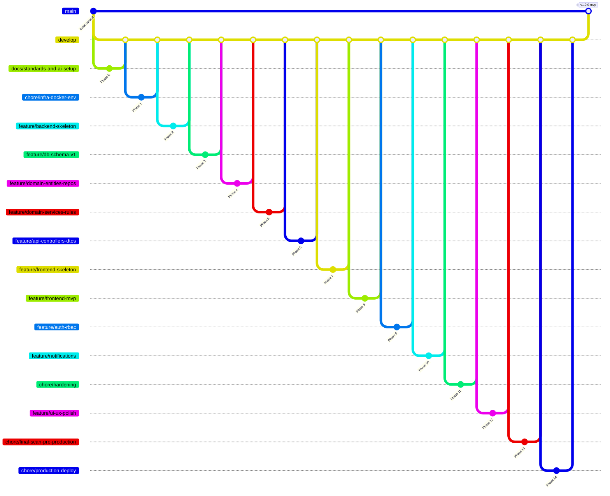

# Implementation Plan
## Faith Laundry Shop Management System

> **Client:** Faith Laundry Shop  
> **Prepared By:** HIMÓTECH  
> **Document ID:** IMPL-001  
> **Version:** 1.0  
> **Date:** 2026-02-13  
> **Purpose:** Phase-by-phase execution playbook with deliverables and acceptance criteria  
> **Status:** Baseline (Development Guide)

---

## Document Control
- **Document Type:** Implementation Plan
- **Related Documents:** [Project Scope](../01-scope/project-scope.md), [User Stories](../02-requirements/user-stories.md), [Business Rules](../02-requirements/business-rules.md), [Architecture](../05-tech-design/architecture.md), [OpenAPI Spec](../05-tech-design/openapi.yaml), [ERD](../04-data-design/erd.dbml), [To-Be Process Flow](../03-process/to-be-flow.md)
- **Confidentiality:** Internal / Academic Use

**Source of Truth:** All phases derive from `/docs` — [user-stories.md](../02-requirements/user-stories.md), [business-rules.md](../02-requirements/business-rules.md), [openapi.yaml](../05-tech-design/openapi.yaml), [erd.dbml](../04-data-design/erd.dbml), [architecture.md](../05-tech-design/architecture.md).

---

## 1. Purpose

This document defines the phase-by-phase execution plan for the Faith Laundry Shop Management System. Each phase includes Purpose, Inputs/Dependencies, Deliverables, Branch name, Suggested commits, PR title, Definition of Done, and User Story/rule coverage.

---

## 2. Guiding Principles

### 2.1 MVP First
Build only what solves the client's real problems first; extend after MVP is validated.

### 2.2 Docs-Driven Development
Documentation is the source of truth. If code behavior changes, docs must change first or in the same PR.

### 2.3 Thin Layers
- **Controllers:** HTTP only
- **Services:** All business rules ([BR-PR-*](../02-requirements/business-rules.md), [BR-OL-*](../02-requirements/business-rules.md), [BR-PAY-*](../02-requirements/business-rules.md))
- **Repositories:** Persistence only
- **Frontend:** No business logic

### 2.4 Environment Safety
- `.env` → local only, never committed
- CI uses Testcontainers
- No secrets in Git

### 2.5 Repository Conventions
- All PRs target `develop` branch
- One feature branch per phase scope
- Use `pull_request_template.md` for PR descriptions

---

## 3. Phase Overview

| Phase | Name | User Stories | Business Rules | Dependencies |
|-------|------|--------------|----------------|--------------|
| 0 | Standards & AI Setup | — | — | None |
| 1 | Infrastructure | — | — | Phase 0 |
| 2 | Backend Skeleton | — | — | Phase 1 |
| 3 | Database Schema | US-01 | BR-OL-01, BR-PAY-02 | Phase 2 |
| 4 | Domain Model | US-01, US-02 | All BR-* | Phase 3 |
| 5 | Business Services | US-01, US-02, US-03, US-06 | BR-PR-*, BR-OL-*, BR-PAY-* | Phase 4 |
| 6 | API Layer | US-01, US-02, US-03, US-04, US-06, US-07, US-08, US-09 | All BR-* | Phase 5 |
| 7 | Frontend Skeleton | — | — | Phase 6 |
| 8 | Frontend MVP | US-01, US-02, US-03, US-04, US-06, US-07, US-08, US-09 | BR-NOTIF-02 | Phase 7 |
| 9 | Auth & RBAC | US-11 | — | Phase 8 |
| 10 | Notifications | US-10 | BR-NOTIF-01 | Phase 8 |
| 11 | Hardening | — | — | Phase 9, 10 |
| 12 | UX Polish | US-08, US-09 | — | Phase 11 |
| 13 | Final Scan & Pre-Production | — | — | Phase 12 |
| 14 | Production Deployment | — | — | Phase 13 |

**MVP Phases:** 0–9 (core delivery). **Post-MVP Phases:** 10 (optional), 11 (hardening). **Release Phases:** 12 (UX), 13 (final scan), 14 (deployment).

---

## 4. Phase Execution Plans

---

### Phase 0 — Standards, Docs & AI Setup **[MVP]**

**Purpose:** Establish repository standards and AI-assisted development guardrails. Documentation under `/docs` is the source of truth.

**Inputs/Dependencies:** None

**Deliverables**
- `.github/copilot-instructions.md` (project context for AI)
- `.github/instructions/backend.instructions.md` (backend patterns)
- `.github/instructions/frontend.instructions.md` (frontend patterns)
- `.github/pull_request_template.md` (PR description template)
- `README.md` (project overview and setup)
- `.env.example` (template; no secrets)
- `.github/workflows/backend-ci.yml` (backend CI pipeline)
- `.github/workflows/frontend-ci.yml` (frontend CI pipeline)

**Branch:** `docs/standards-and-ai-setup`

**Suggested Commits**
```
docs: add Copilot instructions with project context
docs: add backend implementation instructions
docs: add frontend implementation instructions
chore: add pull request template
docs: create README with setup instructions
chore: add .env.example template
ci: add backend CI workflow
ci: add frontend CI workflow
```

**PR Title:** `docs: Add project standards and AI development guidelines`

**Definition of Done**
- [ ] `.github/copilot-instructions.md` references all `/docs/**` files
- [ ] Backend instructions include entity examples and business rule code
- [ ] Frontend instructions prohibit client-side business logic
- [ ] README includes setup instructions for all environments
- [ ] `.env.example` includes all required variables (no secrets)
- [ ] CI workflows run on pull requests to `develop`
- [ ] All documentation links use relative paths
- [ ] No secrets committed to repository

**User Stories:** — | **Business Rules:** —

---

### Phase 1 — Infrastructure & Environment Setup **[MVP]**

**Purpose:** Enable one-command local development with PostgreSQL 16 and environment-based configuration. Per [architecture §8.1](../05-tech-design/architecture.md#81-local-development).

**Inputs/Dependencies:** Phase 0 merged

**Deliverables**
- `docker/docker-compose.yml` (PostgreSQL 16 service)
- `backend/.env` (local backend config, gitignored)
- `frontend/.env.local` (local frontend config, gitignored)
- Updated `.gitignore` (exclude environment files)

**Branch:** `chore/infra-docker-env`

**Suggested Commits**
```
chore: add Docker Compose with PostgreSQL 16
chore: configure backend environment variables
chore: configure frontend environment variables
chore: update .gitignore for environment files
```

**PR Title:** `chore: Set up local development infrastructure with Docker`

**Definition of Done**
- [ ] `docker compose -f docker/docker-compose.yml up -d` starts PostgreSQL 16
- [ ] PostgreSQL exposed on `localhost:5433` → container port `5432`
- [ ] `pgcrypto` extension enabled for UUID generation
- [ ] Backend `backend/.env` includes `DB_HOST`, `DB_PORT`, `DB_NAME`, `DB_USER`, `DB_PASSWORD` (per `backend/src/main/resources/application.yml`)
- [ ] Backend `backend/.env` includes `ALLOWED_ORIGIN` (e.g. `http://localhost:3000`) for CORS
- [ ] Frontend `frontend/.env.local` includes `NEXT_PUBLIC_API_URL` (e.g. `http://localhost:8080/api`)
- [ ] All `.env` and `.env.local` files listed in `.gitignore`
- [ ] Database persists data in Docker volume
- [ ] `docker compose down` stops services cleanly

**User Stories:** — | **Business Rules:** —

---

### Phase 2 — Backend Skeleton **[MVP]**

**Purpose:** Bootstrap a testable Spring Boot application with Flyway and Testcontainers. Per [architecture §3](../05-tech-design/architecture.md#3-technology-stack).

**Inputs/Dependencies:** Phase 1 merged

**Deliverables**
- Spring Boot 3.3+ project structure
- Maven wrapper (`mvnw`, `mvnw.cmd`)
- `pom.xml` with dependencies (Spring Boot, PostgreSQL, Flyway, Testcontainers)
- `application.yml` (main config)
- `application-test.yml` (test config)
- `LaundrySystemApplication.java` (main class)
- `LaundrySystemApplicationTests.java` (smoke test)

**Branch:** `feature/backend-skeleton`

**Suggested Commits**
```
feat: initialize Spring Boot 3.3 project with Java 21
chore: add Maven wrapper
feat: configure Flyway for database migrations
feat: configure Testcontainers for integration tests
test: add application smoke test
```

**PR Title:** `feat: Bootstrap Spring Boot backend with Flyway and Testcontainers`

**Definition of Done**
- [ ] Project uses **Java 21 LTS**
- [ ] Spring Boot version **3.3+**
- [ ] Maven wrapper included (`.\mvnw.cmd` works on Windows)
- [ ] Flyway configured in `application.yml`
- [ ] Testcontainers PostgreSQL 16 configured in `application-test.yml`
- [ ] `.\mvnw.cmd test` passes locally
- [ ] `.\mvnw.cmd spring-boot:run` starts application (requires `backend/.env` with DB_* vars from Phase 1)
- [ ] Application connects to local PostgreSQL (from Phase 1)
- [ ] CI workflow runs tests successfully
- [ ] No compile errors or warnings

**User Stories:** — | **Business Rules:** —

---

### Phase 3 — Database Schema (Flyway V1) **[MVP]**

**Purpose:** Lock the data contract early by implementing the complete schema from [erd.dbml](../04-data-design/erd.dbml).

**Source of Truth:** [erd.dbml](../04-data-design/erd.dbml) — all tables, enums, constraints

**Inputs/Dependencies:** Phase 2 merged

**Deliverables**
- `backend/src/main/resources/db/migration/V1__init.sql`
- PostgreSQL enums: `user_role`, `order_status`, `payment_status`, `payment_method`, `notification_status`
- Tables: `users`, `customers`, `service_rates`, `orders`, `order_add_ons`, `order_status_logs`, `payments`, `notifications`
- Constraints: unique indexes, foreign keys

**Branch:** `feature/db-schema-v1`

**Suggested Commits**
```
feat: add Flyway V1 migration with enums
feat: add users and customers tables
feat: add service_rates table
feat: add orders and order_add_ons tables
feat: add order_status_logs table
feat: add payments table with one-to-one constraint
feat: add notifications table
feat: add database constraints and indexes
```

**PR Title:** `feat: Implement database schema from ERD (V1 migration)`

**Definition of Done**
- [ ] All enums from [erd.dbml](../04-data-design/erd.dbml) created
- [ ] All tables from [erd.dbml](../04-data-design/erd.dbml) created
- [ ] Unique constraint on `orders.reference_number` ([BR-OL-01](../02-requirements/business-rules.md#br-ol-01-order-must-have-a-unique-reference-number))
- [ ] Unique constraint on `payments.order_id` ([BR-PAY-02](../02-requirements/business-rules.md#br-pay-02-payment-must-be-linked-to-an-order))
- [ ] Unique composite index on `customers(last_name, first_name, contact_number)`
- [ ] `pgcrypto` extension enabled for `gen_random_uuid()`
- [ ] Fresh database migration succeeds
- [ ] `spring.jpa.hibernate.ddl-auto=validate` passes
- [ ] Migration is idempotent (can run multiple times safely)
- [ ] No migration rollback required

**User Stories:** US-01 | **Business Rules:** BR-OL-01, BR-PAY-02

---

### Phase 4 — Domain Entities & Repositories **[MVP]**

**Purpose:** Create JPA entities matching [erd.dbml](../04-data-design/erd.dbml) exactly and repository interfaces for data access.

**Source of Truth:** [erd.dbml](../04-data-design/erd.dbml), [architecture §6](../05-tech-design/architecture.md#6-backend-modules-spring-boot)

**Inputs/Dependencies:** Phase 3 merged

**Deliverables**
- **Entities:** `User`, `Customer`, `ServiceRate`, `Order`, `OrderAddOn`, `OrderStatusLog`, `Payment`, `Notification`
- **Enums:** `UserRole`, `OrderStatus`, `PaymentStatus`, `PaymentMethod`, `NotificationStatus`
- **Repositories:** `UserRepository`, `CustomerRepository`, `ServiceRateRepository`, `OrderRepository`, `PaymentRepository`, `NotificationRepository`
- **Integration Tests:** Repository tests using Testcontainers

**Branch:** `feature/domain-entities-repos`

**Suggested Commits**
```
feat: add domain enums matching database schema
feat: add User entity with UUID primary key
feat: add Customer entity
feat: add ServiceRate entity
feat: add Order entity with pricing snapshot fields
feat: add OrderAddOn entity
feat: add OrderStatusLog entity
feat: add Payment entity with one-to-one relationship
feat: add Notification entity
feat: add JPA repositories for all entities
test: add repository integration tests

```

**PR Title:** `feat: Implement JPA entities and repositories from ERD`

**Definition of Done**
- [ ] All entities match [erd.dbml](../04-data-design/erd.dbml) field names and types
- [ ] `User` entity uses `UUID` primary key with `gen_random_uuid()`
- [ ] Other entities use `@GeneratedValue(strategy = IDENTITY)` for `bigserial`
- [ ] `Order` entity includes pricing snapshot fields
- [ ] `Payment.orderId` has `@Column(unique = true)` for one-to-one
- [ ] All entities have `@CreatedDate` and `@LastModifiedDate` where applicable
- [ ] Repository interfaces extend `JpaRepository`
- [ ] Custom query methods follow Spring Data naming conventions
- [ ] Integration tests use `@DataJpaTest` with Testcontainers
- [ ] Tests verify unique constraints throw exceptions
- [ ] `.\mvnw.cmd test` passes with all repository tests
- [ ] No entity-level business logic (entities are anemic)

**User Stories:** US-01, US-02 | **Business Rules:** All BR-* (schema support)

---

### Phase 5 — Core Business Services **[MVP]**

**Purpose:** Enforce all business rules in the service layer. Controllers and repositories do not contain business logic. Per [architecture §5](../05-tech-design/architecture.md#5-layering-and-responsibility).

**Source of Truth:** [business-rules.md](../02-requirements/business-rules.md), [user-stories.md](../02-requirements/user-stories.md)

**Inputs/Dependencies:** Phase 4 merged

**Deliverables**
- **OrderService:** Order creation, pricing computation ([US-01](../02-requirements/user-stories.md#us-01-record-laundry-order), [US-02](../02-requirements/user-stories.md#us-02-automatically-compute-laundry-price))
- **OrderStatusService:** Status updates, transition validation ([US-03](../02-requirements/user-stories.md#us-03-update-laundry-order-status))
- **PaymentService:** Payment recording, validation ([US-06](../02-requirements/user-stories.md#us-06-record-payment-for-laundry-order))
- **CustomerService:** Customer CRUD and search
- **ServiceRateService:** Active rate retrieval
- **Unit Tests:** Service layer business logic tests

**Branch:** `feature/domain-services-rules`

**Suggested Commits**
```
feat: add CustomerService with search functionality
feat: add ServiceRateService to retrieve active rate
feat: add OrderService with pricing computation (BR-PR-01, BR-PR-02, BR-PR-03)
feat: add unique reference number generation (BR-OL-01)
feat: add OrderStatusService with transition validation (BR-OL-03, BR-OL-04)
feat: add PaymentService with amount validation (BR-PAY-03)
test: add OrderService unit tests for pricing rules
test: add OrderStatusService unit tests for transitions
test: add PaymentService unit tests for validation
```

**PR Title:** `feat: Implement business services with rule enforcement (US-01, US-02, US-03, US-06)`

**Definition of Done**
- [ ] OrderService computes `total_loads = ceil(weight_kg / kg_limit_per_load)` from active ServiceRate ([BR-PR-02](../02-requirements/business-rules.md#br-pr-02-additional-load-for-excess-weight))
- [ ] OrderService computes `base_amount`, `extra_minutes_amount`, `grand_total` ([BR-PR-01](../02-requirements/business-rules.md#br-pr-01-base-load-pricing), [BR-PR-03](../02-requirements/business-rules.md#br-pr-03-extra-washing-time-charge))
- [ ] OrderService generates unique `reference_number` ([BR-OL-01](../02-requirements/business-rules.md#br-ol-01-order-must-have-a-unique-reference-number))
- [ ] OrderService sets `current_status = RECEIVED` ([BR-OL-02](../02-requirements/business-rules.md#br-ol-02-initial-order-status))
- [ ] OrderService snapshots pricing from active `ServiceRate`
- [ ] OrderStatusService validates allowed statuses ([BR-OL-03](../02-requirements/business-rules.md#br-ol-03-allowed-order-status-values))
- [ ] OrderStatusService prevents release unless `READY_FOR_PICKUP` ([BR-OL-05](../02-requirements/business-rules.md#br-ol-05-release-preconditions))
- [ ] OrderStatusService logs all status changes to `order_status_logs`
- [ ] PaymentService validates amount equals `order.grand_total` ([BR-PAY-03](../02-requirements/business-rules.md#br-pay-03-payment-amount-validation))
- [ ] PaymentService enforces one payment per order ([BR-PAY-02](../02-requirements/business-rules.md#br-pay-02-payment-must-be-linked-to-an-order))
- [ ] PaymentService updates `order.payment_status = PAID` ([BR-PAY-04](../02-requirements/business-rules.md#br-pay-04-payment-status))
- [ ] Unit tests mock repositories (no database access)
- [ ] Tests cover all business rule branches
- [ ] `.\mvnw.cmd test` passes with >80% service coverage

**User Stories:** US-01, US-02, US-03, US-06 | **Business Rules:** BR-PR-*, BR-OL-*, BR-PAY-*

---

### Phase 6 — API Layer (OpenAPI First) **[MVP]**

**Purpose:** Expose REST APIs aligned to [openapi.yaml](../05-tech-design/openapi.yaml) with DTOs and global error handling. Controllers delegate to services; no business logic in controllers.

**Inputs/Dependencies:** Phase 5 merged

**Source of Truth:** [openapi.yaml](../05-tech-design/openapi.yaml) — all paths, schemas, status codes

**Deliverables**
- **Controllers:** CustomerController, ServiceRatesController, OrderController, PaymentController, ReportsController (thin HTTP handlers per [architecture §5](../05-tech-design/architecture.md#5-layering-and-responsibility))
- **DTOs:** Request/Response objects matching OpenAPI schemas exactly
- **MapStruct Mappers:** Entity-to-DTO mapping (compile-time)
- **Global Exception Handler:** Consistent `ErrorResponse` schema
- **CORS:** Backend allows frontend origin (`ALLOWED_ORIGIN`) for cross-origin requests
- **Endpoints (per OpenAPI):**
  - Customers: POST/GET `/api/v1/customers`, GET `/api/v1/customers/{id}`
  - Service Rates: GET `/api/v1/service-rates`, GET `/api/v1/service-rates/active`
  - Orders: POST/GET `/api/v1/orders`, GET `/api/v1/orders/reference/{ref}`, GET `/api/v1/orders/{id}`, PATCH `/api/v1/orders/{id}/status`
  - Payments: POST `/api/v1/payments`, GET `/api/v1/payments/{id}` ([US-07](../02-requirements/user-stories.md#us-07-view-payment-history))
  - Reports: GET `/api/v1/reports/sales/daily`, `/monthly`, `/yearly`
- **Integration Tests:** API endpoint tests with MockMvc

**Branch:** `feature/api-controllers-dtos`

**Suggested Commits**
```
feat: add DTO classes matching OpenAPI schemas
feat: add MapStruct mappers for entity-to-DTO conversion
feat: add global exception handler for ErrorResponse
feat: add CustomerController (POST, GET list, GET by ID)
feat: add ServiceRatesController (GET list, GET active)
feat: add OrderController with create, list, track, status update (US-01, US-03, US-04)
feat: add PaymentController with create and get by ID (US-06, US-07)
feat: add ReportsController for daily, monthly, yearly sales (US-08, US-09)
feat: add CORS configuration for frontend origin
test: add controller integration tests
```

**PR Title:** `feat: Implement REST API layer aligned to OpenAPI (US-01, US-02, US-03, US-04, US-06, US-08)`

**Definition of Done**
- [ ] All DTOs match [openapi.yaml](../05-tech-design/openapi.yaml) schemas exactly
- [ ] Controllers delegate to services (< 10 lines per method)
- [ ] Controllers return DTOs via mappers, never entities
- [ ] Global exception handler returns `ErrorResponse` schema
- [ ] HTTP status codes match OpenAPI spec (200, 201, 400, 404, 409)
- [ ] Bean Validation annotations on request DTOs
- [ ] CORS configured to allow frontend origin (`ALLOWED_ORIGIN`)
- [ ] POST `/api/v1/orders` creates order with pricing ([US-01](../02-requirements/user-stories.md#us-01-record-laundry-order), [US-02](../02-requirements/user-stories.md#us-02-automatically-compute-laundry-price))
- [ ] GET `/api/v1/orders/reference/{ref}` returns tracking info ([US-04](../02-requirements/user-stories.md#us-04-track-laundry-order-by-reference-number), [BR-NOTIF-02](../02-requirements/business-rules.md#br-notif-02-tracking-by-reference-number))
- [ ] PATCH `/api/v1/orders/{id}/status` updates status ([US-03](../02-requirements/user-stories.md#us-03-update-laundry-order-status))
- [ ] POST `/api/v1/payments` records payment ([US-06](../02-requirements/user-stories.md#us-06-record-payment-for-laundry-order))
- [ ] GET `/api/v1/payments/{id}` returns payment ([US-07](../02-requirements/user-stories.md#us-07-view-payment-history))
- [ ] GET `/api/v1/reports/sales/daily`, `/monthly`, `/yearly` return sales ([US-08](../02-requirements/user-stories.md#us-08-view-daily-sales-report), [US-09](../02-requirements/user-stories.md#us-09-view-monthly-and-yearly-income-reports))
- [ ] Integration tests use `@WebMvcTest` or `@SpringBootTest`
- [ ] All API tests pass with realistic data
- [ ] No OpenAPI contract violations

**User Stories:** US-01, US-02, US-03, US-04, US-06, US-07, US-08, US-09 | **Business Rules:** All BR-*

---

### Phase 7 — Frontend Skeleton **[MVP]**

**Purpose:** Bootstrap Next.js 14 App Router foundation with TypeScript, Tailwind CSS, and API client integration. No UI flows yet.

**Inputs/Dependencies:** Phase 6 merged (backend must be running with CORS enabled)

**Source of Truth:** [architecture.md §3](../05-tech-design/architecture.md#3-technology-stack), [openapi.yaml](../05-tech-design/openapi.yaml) for types

**See also:** [phase7-frontend-skeleton-guide.md](phase7-frontend-skeleton-guide.md) for step-by-step implementation

**Deliverables**
- Next.js 14 project with App Router (per [frontend.instructions.md](../../.github/instructions/frontend.instructions.md))
- TypeScript configuration (`tsconfig.json`) with strict mode
- Tailwind CSS setup
- API client module (`lib/api/client.ts`) — fetch wrapper, `ErrorResponse` handling
- TypeScript types from OpenAPI schemas (manual or `openapi-typescript`)
- Environment variables (`NEXT_PUBLIC_API_URL` in `frontend/.env.local`)
- Minimal layout and health-check example (proves API connectivity)

**Branch:** `feature/frontend-skeleton`

**Suggested Commits**
```
feat: initialize Next.js 14 project with App Router
feat: configure TypeScript with strict mode
feat: configure Tailwind CSS
feat: add API client module with fetch wrapper
feat: add TypeScript types from OpenAPI schemas
chore: configure environment variables
```

**PR Title:** `feat: Bootstrap Next.js 14 frontend with TypeScript and Tailwind`

**Definition of Done**
- [ ] Next.js version **14+** with App Router (not Pages Router)
- [ ] TypeScript strict mode enabled
- [ ] Tailwind CSS configured and working
- [ ] API client module uses `NEXT_PUBLIC_API_URL` from `.env.local`
- [ ] TypeScript types match [openapi.yaml](../05-tech-design/openapi.yaml) schemas
- [ ] `npm run dev` starts development server on `localhost:3000`
- [ ] `npm run build` compiles without errors
- [ ] `npm run typecheck` passes (if configured)
- [ ] API client includes error handling for `ErrorResponse`
- [ ] No hardcoded API URLs
- [ ] No business logic in API client (only fetch calls)
- [ ] Health check or equivalent proves backend connectivity (requires backend running with CORS)

**User Stories:** — | **Business Rules:** —

---

### Phase 8 — Frontend MVP **[MVP]**

**Purpose:** Implement end-to-end user flows for order intake, tracking, payment, and reporting without client-side business logic. All totals and validation come from the API.

**Inputs/Dependencies:** Phase 7 merged

**Source of Truth:** [user-stories.md](../02-requirements/user-stories.md), [frontend.instructions.md](../../.github/instructions/frontend.instructions.md) (App Router structure)

**Deliverables**
- **Order Intake Page:** Create order form with customer selection/creation ([US-01](../02-requirements/user-stories.md#us-01-record-laundry-order), [US-02](../02-requirements/user-stories.md#us-02-automatically-compute-laundry-price))
- **Order Detail Page:** View order with status timeline and status update ([US-03](../02-requirements/user-stories.md#us-03-update-laundry-order-status), [US-05](../02-requirements/user-stories.md#us-05-verify-laundry-before-release))
- **Payment Page:** Record payment ([US-06](../02-requirements/user-stories.md#us-06-record-payment-for-laundry-order))
- **Payment History / View:** Get payment by ID ([US-07](../02-requirements/user-stories.md#us-07-view-payment-history))
- **Public Tracking Page:** Track by reference number ([US-04](../02-requirements/user-stories.md#us-04-track-laundry-order-by-reference-number))
- **Reports Pages:** Daily, monthly, yearly sales ([US-08](../02-requirements/user-stories.md#us-08-view-daily-sales-report), [US-09](../02-requirements/user-stories.md#us-09-view-monthly-and-yearly-income-reports))
- **Navigation:** Layout with menu (per [architecture §4.2](../05-tech-design/architecture.md#42-containers))

**Branch:** `feature/frontend-mvp`

**Suggested Commits**
```
feat: add order intake form with customer selection (US-01)
feat: add order detail page with status timeline (US-03)
feat: add payment recording form (US-06)
feat: add payment view / history (US-07)
feat: add public order tracking page (US-04)
feat: add daily sales report page (US-08)
feat: add monthly and yearly report pages (US-09)
feat: add navigation layout and menu
style: add responsive design with Tailwind
```

**PR Title:** `feat: Implement frontend MVP flows (US-01, US-02, US-03, US-04, US-06, US-07, US-08, US-09)`

**Definition of Done**
- [ ] Order intake form collects weight, extra minutes, add-ons
- [ ] Order form displays computed totals **from API response** (no client-side calculation)
- [ ] Order detail shows status timeline from `order_status_logs`
- [ ] Payment form validates amount matches order total (validation from API)
- [ ] Public tracking page shows limited data per [BR-NOTIF-02](../02-requirements/business-rules.md#br-notif-02-tracking-by-reference-number)
- [ ] Daily, monthly, yearly reports aggregate paid orders only
- [ ] All forms handle API errors gracefully
- [ ] Mobile-responsive design (Tailwind breakpoints)
- [ ] No hardcoded pricing formulas in frontend
- [ ] No client-side business rule duplication
- [ ] End-to-end flow: Create → Process → Pay → Release → Report
- [ ] `npm run build` succeeds without warnings

**User Stories:** US-01, US-02, US-03, US-04, US-05, US-06, US-07, US-08, US-09 | **Business Rules:** BR-NOTIF-02

---

### Phase 9 — Authentication & RBAC **[MVP]**

**Purpose:** Secure the application with role-based access control for Owner vs. Staff ([US-11](../02-requirements/user-stories.md#us-11-user-login-and-role-based-access)). Per [architecture §9](../05-tech-design/architecture.md#9-security-mvp): Owner (reports, rates); Staff (orders, status, payments, customers).

**Inputs/Dependencies:** Phase 8 merged

**Source of Truth:** [openapi.yaml](../05-tech-design/openapi.yaml) — `/api/v1/auth/login`, [User Stories §6](../02-requirements/user-stories.md#6-epic-6-user-access--control)

**Deliverables**
- Login page and authentication flow
- Session/JWT token management (cookie or header)
- Role-based guards for Owner-only endpoints (reports, rates)
- Seeded users migration (`V2__seed_users.sql`) — Owner and Staff
- Frontend role-based UI rendering and route guards

**Branch:** `feature/auth-rbac`

**Suggested Commits**
```
feat: add Flyway V2 migration to seed default users
feat: add authentication service with password hashing
feat: add login endpoint (POST /api/v1/auth/login per OpenAPI)
feat: add JWT token generation and validation
feat: add role-based access control annotations
feat: add login page with form
feat: add authentication context provider
feat: add role-based route guards
feat: restrict reports access to Owner role only
```

**PR Title:** `feat: Implement authentication and role-based access control (US-11)`

**Definition of Done**
- [ ] `V2__seed_users.sql` creates default Owner and Staff users
- [ ] Passwords hashed with BCrypt (cost factor 10 for dev)
- [ ] POST `/api/v1/auth/login` returns JWT token (per [OpenAPI](../05-tech-design/openapi.yaml))
- [ ] Backend endpoints enforce `@PreAuthorize("hasRole('OWNER')")` for reports
- [ ] Frontend redirects unauthenticated users to login
- [ ] Staff cannot access `/reports/**` routes
- [ ] Owner can access all routes
- [ ] Session persists across page refreshes
- [ ] Logout clears session/token
- [ ] Default credentials documented (e.g. `docs/development-credentials.md` or README)
- [ ] Authentication tested with both roles

**User Stories:** US-11 | **Business Rules:** —

---

### Phase 10 — Notifications **[Post-MVP]**

**Purpose:** Trigger customer notifications when orders reach READY_FOR_PICKUP status ([US-10](../02-requirements/user-stories.md#us-10-notify-customer-when-laundry-is-ready), [BR-NOTIF-01](../02-requirements/business-rules.md#br-notif-01-customer-ready-notification-trigger)). Optional for MVP per [architecture §2.2](../05-tech-design/architecture.md#22-out-of-scope-mvp).

**Inputs/Dependencies:** Phase 8 merged (notifications are optional; can run parallel to Phase 9)

**Deliverables**
- Notification service to create records
- Event listener on status change to READY_FOR_PICKUP
- Notification list UI (staff view)
- Optional SMS/email adapter stub

**Branch:** `feature/notifications`

**Suggested Commits**
```
feat: add NotificationService to create notification records
feat: add event listener for READY_FOR_PICKUP status (BR-NOTIF-01)
feat: add notification list endpoint
feat: add notification list page for staff
feat: add SMS adapter stub (placeholder for future integration)
```

**PR Title:** `feat: Implement order ready notifications (US-10, BR-NOTIF-01)`

**Definition of Done**
- [ ] Notification record created when status → READY_FOR_PICKUP ([BR-NOTIF-01](../02-requirements/business-rules.md#br-notif-01-customer-ready-notification-trigger))
- [ ] Notification includes `order_id`, `customer_id`, `message`, `status`
- [ ] Notification message includes order reference number
- [ ] GET `/api/v1/notifications` endpoint returns notifications
- [ ] Staff can view notification list in UI
- [ ] Notification status defaults to PENDING
- [ ] SMS adapter is stubbed (logs message instead of sending)
- [ ] Event listener tested with status change
- [ ] Optional: Mark notification as SENT after delivery

**User Stories:** US-10 | **Business Rules:** BR-NOTIF-01

---

### Phase 11 — Hardening & Developer Experience **[MVP]**

**Purpose:** Polish the application for production readiness and developer experience improvements.

**Inputs/Dependencies:** Phase 9 merged (Phase 10 optional; Phase 11 can proceed after Phase 9)

**Deliverables**
- Pagination for order/payment lists
- Structured logging (SLF4J with logback)
- API request/response logging
- CI quality gates (test coverage, linting)
- Docker Compose for full stack (optional)
- Release notes and deployment guide

**Branch:** `chore/hardening`

**Suggested Commits**
```
feat: add pagination support to order list endpoint
feat: add filtering by date range and status
feat: configure structured logging with logback
feat: add request/response logging interceptor
ci: add test coverage threshold check
ci: add code quality checks (Checkstyle, ESLint)
chore: add Docker Compose for full stack deployment
docs: add deployment guide
docs: add release notes for MVP v1.0
```

**PR Title:** `chore: Harden application with logging, pagination, and CI quality gates`

**Definition of Done**
- [ ] Order and payment lists support pagination (`page`, `size` params)
- [ ] Lists support filtering by date range and status
- [ ] Structured JSON logging in production profile
- [ ] Request/response logging for debugging (dev profile only)
- [ ] CI enforces >80% test coverage
- [ ] Backend passes Checkstyle with zero violations
- [ ] Frontend passes ESLint with zero errors
- [ ] Optional: Docker Compose runs entire stack (backend + frontend + db)
- [ ] Deployment guide documented
- [ ] Release notes include feature list and known limitations

**User Stories:** — | **Business Rules:** —

---

### Phase 12 — User Experience (UX) Polish & Visualization **[Post-MVP]**

**Purpose:** Transform the functional MVP into a professional, responsive product with visual feedback, data visualization, and streamlined workflows based on user testing.

**Inputs/Dependencies:** Phase 11 merged

**Deliverables**

* **Toast Notifications:** Replace browser alerts with non-blocking success/error toasts (e.g., using `sonner` or `react-hot-toast`)
* **Skeleton Loaders:** Visual placeholders for Order List and Dashboard while fetching data
* **Empty States:** Friendly UI components for empty tables/lists
* **Dashboard Charts:** Visual graphs for Daily/Monthly sales ([US-08](../02-requirements/user-stories.md#us-08-view-daily-sales-report))
* **Mobile Optimization:** Touch-friendly buttons for status updates on small screens
* **Receipt Printing Style:** Print-friendly CSS for order receipts

**Branch:** `feature/ui-ux-polish`

**Suggested Commits**

```
feat: install and configure toast notification library
feat: replace alert() with toast.success() and toast.error()
feat: add skeleton loader components for tables and cards
style: add empty state illustrations for orders and payments
feat: install recharts and implement sales trend graph (US-08)
style: optimize status update buttons for mobile touch targets
style: add print-specific CSS for thermal receipt layout
fix: address layout shifts during data loading

```

**PR Title:** `feat: Polish UI/UX with visual feedback and data visualization`

**Definition of Done**

* [ ] All Create/Update/Delete actions show a Toast notification
* [ ] No "layout shift" when data loads (Skeletons match final height)
* [ ] Dashboard displays a Bar or Area chart for Sales data
* [ ] Tables show a "No data found" graphic instead of blank rows
* [ ] Status buttons are easily tappable (min 44px height) on mobile
* [ ] `Ctrl+P` on Order Detail page generates a clean thermal receipt layout
* [ ] Dark mode/Light mode consistency checked (if applicable)
* [ ] Lighthouse accessibility score > 90

**User Stories:** US-08, US-09 | **Business Rules:** —

---

### Phase 13 — Final Scan & Pre-Production Checklist **[Release]**

**Purpose:** Perform a comprehensive scan of all files, checks, fixes, and polish before deployment. Ensures no secrets, no debug code, no broken links, and full traceability to docs.

**Inputs/Dependencies:** Phase 12 merged (or Phase 11 if Phase 12 skipped)

**Deliverables**
- **Pre-production checklist** — Documented and executed
- **Fixes** — All critical and high-priority issues resolved
- **Documentation sync** — Docs match implementation

**Branch:** `chore/final-scan-pre-production`

**Suggested Commits**
```
chore: add pre-production checklist document
fix: resolve lint/typecheck/security findings
fix: remove debug code and console logs
fix: correct broken links and outdated doc references
chore: verify no secrets or hardcoded credentials
docs: sync implementation plan and README with current state
```

**PR Title:** `chore: Final scan, fixes, and polish before production deployment`

**Definition of Done**

**Code & Build**
- [ ] Backend: `.\mvnw.cmd clean test` passes
- [ ] Backend: `.\mvnw.cmd package` produces runnable JAR
- [ ] Frontend: `npm run build` succeeds without errors
- [ ] Frontend: `npm run typecheck` passes
- [ ] Frontend: `npm run lint` passes with zero errors
- [ ] No `console.log`, `System.out`, or debug breakpoints in production paths
- [ ] No TODO/FIXME with critical severity left unaddressed

**Security & Configuration**
- [ ] No secrets, API keys, or passwords in code or committed files
- [ ] `.env`, `.env.local` in `.gitignore`; only `.env.example` committed
- [ ] Production config uses environment variables, not hardcoded values
- [ ] CORS and allowed origins configured for production domain

**Documentation**
- [ ] README reflects current setup and run instructions
- [ ] All `/docs` links valid; no broken references
- [ ] OpenAPI spec matches implemented endpoints
- [ ] ERD/schema matches database migrations
- [ ] Implementation plan phase status accurate

**Traceability**
- [ ] User stories (US-xx) traceable to implemented features
- [ ] Business rules (BR-xx) enforced and documented
- [ ] Known limitations documented in release notes

**Polish**
- [ ] Error messages user-friendly (no stack traces to end users)
- [ ] Loading and empty states handled
- [ ] Accessibility basics verified (keyboard nav, labels)

**User Stories:** — | **Business Rules:** —

---

### Phase 14 — Production Deployment & Handover **[Release]**

**Purpose:** Deploy the system to the shop's hardware and perform final acceptance testing.

**Inputs/Dependencies:** Phase 13 merged (final scan complete)

**Deliverables**

* **Production Docker Compose:** `docker-compose.prod.yml` (optimized images)
* **Nginx Configuration:** Reverse proxy with SSL setup
* **Database Backup Script:** Automated nightly backups
* **User Manual:** PDF guide for Owner and Staff
* **Handover Session:** Training the staff

**Branch:** `chore/production-deploy`

**Suggested Commits**

```
chore: add production docker-compose with Nginx
config: add Nginx configuration for reverse proxy
chore: create database backup shell script
docs: add end-user manual and troubleshooting guide
chore: update README with production deployment steps

```

**PR Title:** `chore: Prepare production environment and documentation`

**Definition of Done**

* [ ] Application runs via `docker compose -f docker-compose.prod.yml up -d`
* [ ] Application accessible via local network IP or Domain
* [ ] HTTPS enabled (Self-signed or Let's Encrypt)
* [ ] Database data persists across container restarts
* [ ] Backup script successfully creates `.sql.gz` dump
* [ ] Owner and Staff can log in from their own devices
* [ ] Receipt printer successfully prints from the browser
* [ ] Client sign-off received

**User Stories:** — | **Business Rules:** —

---

## 5. Branch Flow Strategy



**Rules:**
- All feature branches merge to `develop`
- Each phase is a separate PR
- Phases must complete in order (respect dependencies)
- `main` receives merges only for releases

---

## 6. How to Use This Playbook

### For Each Phase
1. **Check Dependencies:** Ensure prerequisite phases are merged
2. **Create Branch:** Use exact branch name from phase plan
3. **Implement Deliverables:** Follow suggested commit messages; reference **Source of Truth** docs
4. **Run Definition of Done:** Check all boxes before PR
5. **Create PR:** Use provided PR title; fill `pull_request_template.md`
6. **Link Requirements:** Reference US-xx and BR-xx in PR description
7. **Merge:** Only merge when all checkboxes pass

### Backend Run Note
Backend requires environment variables (`DB_PASSWORD`, etc.). Use `backend/.env` (copy from `backend/.env.example`) or IDE run profile with env vars. Maven does not load `.env` by default; use `backend/run-backend.ps1` or set vars before `.\mvnw.cmd spring-boot:run`.

### Non-Negotiable Rules
- Treat merged phases as **immutable**
- Never skip repository/service tests
- Never hardcode business rules in frontend
- Always reference US-xx and BR-xx in commits/PRs
- Keep controllers thin (< 10 lines)
- Keep services focused (single responsibility)
- Match OpenAPI contracts exactly

---

## 7. MVP Coverage Summary

| User Story | Phase(s) Delivering |
|------------|---------------------|
| [US-01](../02-requirements/user-stories.md#us-01-record-laundry-order) Record Laundry Order | 5, 6, 8 |
| [US-02](../02-requirements/user-stories.md#us-02-automatically-compute-laundry-price) Automatically Compute Laundry Price | 5, 6, 8 |
| [US-03](../02-requirements/user-stories.md#us-03-update-laundry-order-status) Update Laundry Order Status | 5, 6, 8 |
| [US-04](../02-requirements/user-stories.md#us-04-track-laundry-order-by-reference-number) Track Laundry Order by Reference Number | 6, 8 |
| [US-05](../02-requirements/user-stories.md#us-05-verify-laundry-before-release) Verify Laundry Before Release | 5, 6, 8 |
| [US-06](../02-requirements/user-stories.md#us-06-record-payment-for-laundry-order) Record Payment | 5, 6, 8 |
| [US-07](../02-requirements/user-stories.md#us-07-view-payment-history) View Payment History | 6, 8 |
| [US-08](../02-requirements/user-stories.md#us-08-view-daily-sales-report) View Daily Sales Report | 6, 8 |
| [US-09](../02-requirements/user-stories.md#us-09-view-monthly-and-yearly-income-reports) View Monthly and Yearly Income Reports | 6, 8 |
| [US-11](../02-requirements/user-stories.md#us-11-user-login-and-role-based-access) User Login and Role-Based Access | 9 |
| [US-10](../02-requirements/user-stories.md#us-10-notify-customer-when-laundry-is-ready) Notify Customer (Optional MVP) | 10 |

**Business Rules:** BR-PR-*, BR-OL-*, BR-PAY-* → Phase 5; BR-NOTIF-02 → Phase 6, 8; BR-NOTIF-01 → Phase 10; BR-REC-* → Phase 6, 8
